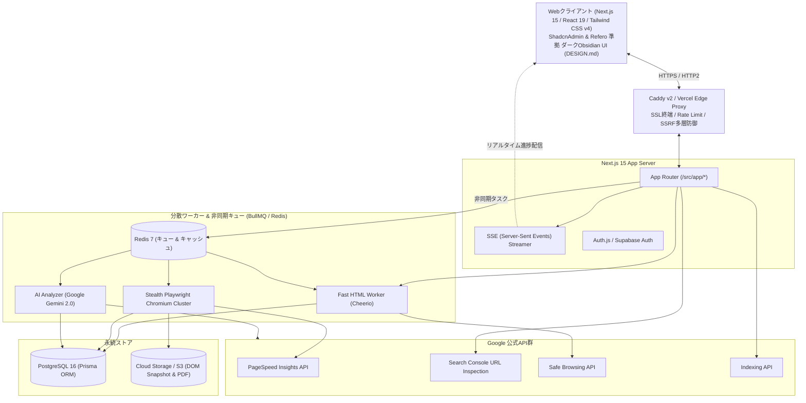

# SEO Analyzer (次世代SEO & AI表示診断・技術監査プラットフォーム)

> **最高峰の技術的SEO監査・Google公式API統合・AI表示（GEO/LLMO）最適化・メタ不具合自動検知プラットフォーム**  
> 
> 公式UI/UXデザインリファレンス:
> - [ShadcnAdmin](https://shadcnadmin.com/) — shadcn/ui, Tailwind CSS v4, OKLCH, Border Grids, Stat Cards, DataTables
> - [Refero Styles](https://styles.refero.design/) — AI-Native DESIGN.md Standard, Obsidian Gallery Dark Aesthetic, 16:10 Media Containers, Pill Tabs
>
> 150項目以上の精密診断エンジンと、最高峰のプロフェッショナル・ダッシュボードを備えたエンタープライズSaaS設計です。

---

## 🚀 コア機能・ハイライト

1. **Google公式API完全統合 & 具体的修正案の自動生成**
   - **PageSpeed Insights (v5)**: CrUX実測値 & LighthouseラボデータによるCore Web Vitals精密測定。
   - **Search Console URL Inspection**: Googlebot公式のインデックス状態（未登録/重複/canonical不備）照会。
   - **Safe Browsing (v4)** & **Google Indexing API (v3)**: セキュリティ脅威判定 & 即時巡回通知。
   - **Gemini 2.0 API**: 課題に対するBefore/After差分と、Next.js App Router向けコピペ用改善コードの動的生成。
2. **SEO以外の次世代「AI表示対応」 (GEO / LLMO / Agent-Ready Web)**
   - **AI表示プレビューシミュレーター**: Google AI Overviews、SearchGPT、Perplexityでの要約・引用カードを画面上で完全再現。
   - **`llms.txt` / `llms-full.txt` 自動生成**: AIモデル向け公式マークダウン仕様のワンクリック合成。
   - **AIスニペット最大表示タグ**: `max-snippet:-1` メタタグの自動検査とLLMクローラー制御。
3. **メタ情報・タグ競合・文字化け 完全検知エンジン**
   - 複数Canonicalタグ重複、Robotsディレクティブの矛盾、文字コード（Mojibake）の検知。
   - 相対パスCanonical/OGP画像の検出、Hreflang多言語相互リンク欠落の検出。
4. **JavaScript SEO & DOM差分解析 (Raw HTML vs Rendered DOM Diff)**
   - 静的HTMLパースとHeadless Chrome描画後のDOMを比較し、JSによる遅延メタ注入やハイドレーションエラーを可視化。
5. **サイト全体ディープクロール & 内部リンクネットワーク可視化**
   - D3.jsによる内部PageRankグラフ、リンク切れ（404）、孤立ページ、クリック階層の深さ（Click Depth）を網羅。
6. **Time-travel 履歴差分比較**
   - デプロイ前後や施策実施前後のスコア変動とタグ変更差分をタイムライン比較。

---

## 🏗️ システムアーキテクチャ概要

---

## 📚 設計書一覧 (Complete Documentation Suite)

本プロジェクトは、以下の11件の詳細仕様書により完全設計されています。

| ファイル | ドキュメント名 | 内容概要 |
|---|---|---|
| [`DESIGN.md`](./DESIGN.md) | **UI/UXデザインシステム規約** | ShadcnAdmin & Refero統合トークン、OKLCH、Border Grid、ピル型タブ |
| [`docs/00_OVERVIEW.md`](./docs/00_OVERVIEW.md) | **プロジェクト全体要件・KPI** | 背景、ターゲットユーザー、事業要件、成功KPI |
| [`docs/01_BASIC_DESIGN.md`](./docs/01_BASIC_DESIGN.md) | **基本設計書 & 全25画面一覧** | アーキテクチャ、全25画面一覧、業務フロー、非機能要件 |
| [`docs/02_SEO_ANALYSIS_ENGINE.md`](./docs/02_SEO_ANALYSIS_ENGINE.md) | **SEO評価エンジン・150+検査項目** | スコアリング数式、150+検査ルール、具体的修正案生成ロジック |
| [`docs/03_DATABASE_DESIGN.md`](./docs/03_DATABASE_DESIGN.md) | **データベース詳細設計** | ER図、Prisma Schema、Google連携、AI表示、有向グラフテーブル |
| [`docs/04_API_SPECIFICATION.md`](./docs/04_API_SPECIFICATION.md) | **API詳細仕様書** | 全エンドポイントマトリクス、TypeScript DTO型、SSEストリーム |
| [`docs/05_UI_UX_DESIGN.md`](./docs/05_UI_UX_DESIGN.md) | **UI/UX・画面詳細設計書** | ShadcnAdminダッシュボード、Refero 16:10プレビュー、DOM差分 |
| [`docs/06_AI_GEO_OPTIMIZATION.md`](./docs/06_AI_GEO_OPTIMIZATION.md) | **AI表示・GEO最適化詳細設計書** | AI Overviews/Perplexityシミュレータ、`llms.txt`、Bot制御 |
| [`docs/07_GOOGLE_OFFICIAL_APIS.md`](./docs/07_GOOGLE_OFFICIAL_APIS.md) | **Google公式API連携仕様書** | PSI, GSC URL Inspection, Safe Browsing, Indexing, Gemini |
| [`docs/08_OPERATIONS_AND_SECURITY.md`](./docs/08_OPERATIONS_AND_SECURITY.md) | **運用・インフラ・セキュリティ設計** | Caddyfile、SSRF多層防御、AES-256-GCM暗号化、日次バックアップ |
| [`docs/09_META_DEFECT_DETECTION.md`](./docs/09_META_DEFECT_DETECTION.md) | **メタ不具合・競合・文字化け仕様書**| タグ重複、Mojibake、Canonical不整合、SSR遅延注入、Hreflang |
| [`docs/10_CRAWLER_AND_SCRAPING_ENGINE.md`](./docs/10_CRAWLER_AND_SCRAPING_ENGINE.md) | **クローラー・SPA描画判定仕様書** | WAF対策、ハイドレーション待機、CMPバナー無効化、チェックポイント再開 |

---

## 🛠️ 技術スタック

- **Frontend**: Next.js 15 (App Router), React 19, TypeScript 5.5, Tailwind CSS v4 (`@theme`, OKLCH), shadcn/ui, Lucide React, Recharts, D3.js
- **Backend & Crawler**: Next.js Server Actions / Route Handlers, Node.js 22 LTS, Playwright, Cheerio, BullMQ
- **Database & Cache**: PostgreSQL 16, Prisma ORM 5.22, Redis 7
- **AI & Official APIs**: Google PageSpeed Insights v5, Google Search Console API, Google Safe Browsing v4, Google Indexing v3, Google Gemini 2.0 Flash / Pro
- **Infrastructure**: Caddy v2, Docker, Linux (PM2), Let's Encrypt SSL
