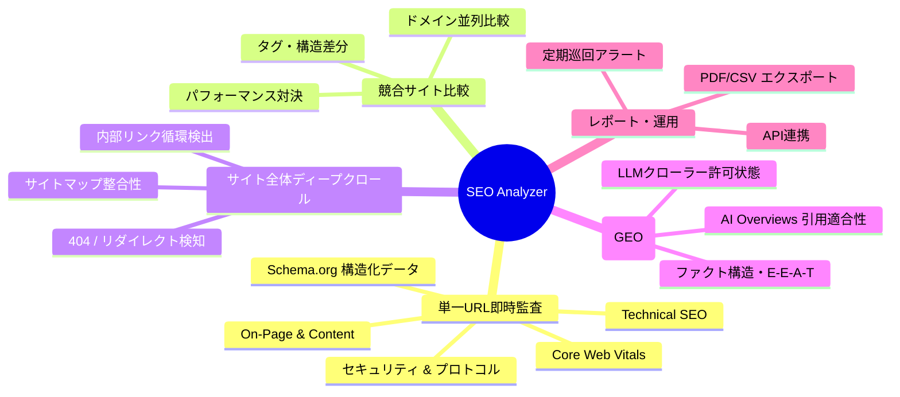

# 00. プロジェクト全体概要・要件定義 (OVERVIEW)

> **プロジェクト名称**: SEO Analyzer (次世代SEO評価・調査・競合分析プラットフォーム)  
> **バージョン**: 1.0.0  
> **作成日**: 2026年9月  
> **運営形態**: 個人運営の趣味・オープンソースプロジェクト

---

## 1. プロジェクトの目的と背景

### 1.1 背景
現代のWebサイト運営において、検索エンジン最適化（SEO）は事業の成否を分ける極めて重要な要素です。
しかしながら、従来のSEOツールには以下のような課題が存在します：
1. **海外製ツールの高コスト・複雑さ**: AhrefsやSemrush等の海外ツールは高額（月額数万円〜）かつ機能が多すぎて直感的な課題特定が難しい。
2. **現代のWeb技術への追従不足**: Next.js、Nuxt、RemixなどのモダンSSR/SSGフレームワーク、Core Web Vitals、Schema.org構造化データ、動的レンダリングへの評価が不十分。
3. **AI検索（GEO / LLMO）への未対応**: ChatGPT Search、Google AI Overviews、Perplexity等のLLMベースのAI検索エンジンが普及する中、従来のキーワードマッチング中心のSEO診断では「AIに引用・参照されるコンテンツ」の最適化が診断できない。
4. **具体的な改善アクションの欠如**: 「Titleが長い」「LCPが遅い」といった指摘にとどまり、具体的にエンジニアやライターが「どのHTML・Next.jsコードに書き換えるべきか」が示されない。

### 1.2 目的
本プロジェクトは、**「URLを入力するだけで、技術的SEO、コンテンツ品質、表示パフォーマンス、そしてAI検索（GEO）適合性を瞬時に多角診断し、コピペ可能な改善コードと施策ステップを提示するオールインワンSEOプラットフォーム」** を構築することを目的とします。

---

## 2. ターゲットユーザー

| ユーザー層 | 主なニーズ・利用シナリオ |
|---|---|
| **自社Webマスター / 開発エンジニア** | デプロイ前のステージング・本番サイトの技術的SEO監査、Core Web Vitals改善箇所の特定、Next.js/Reactでのメタタグ・JSON-LD実装チェック |
| **SEOコンサルタント / マーケター** | クライアントへのSEO診断レポート提出（PDF白書）、競合サイトとの差分分析、キーワードや見出し設計の比較 |
| **オウンドメディア運営者 / ライター** | 記事単位のタイトル/見出し構造、文字数、キーワード網羅率、AI Overviewsで要約されやすい構成の事前確認 |
| **経営者 / サイトオーナー** | サイト全体の健全度スコア（0〜100点）の把握、月次のSEO健全性の定点モニタリング |

---

## 3. 主要機能スコープ (Feature Scope)

---

## 4. 成功指標 (KPI / Metrics)

| 指標カテゴリ | KPI項目 | 目標値 | 測定方法 |
|---|---|---|---|
| **診断パフォーマンス** | 単一URL即時診断完了時間 | **3.0秒以内** (キャッシュ時 0.5秒以内) | サーバーレスポンス時間ログ |
| **診断網羅性** | 検査項目数 | **100項目以上** | テストスイート項目数 |
| **アクション率** | レポート閲覧後の改善コードコピー率 | **35%以上** | UIイベントトラッキング |
| **システム稼働率** | クローラー・Webサービス稼働率 | **99.9%以上** | 外形監視（Uptime Kuma等） |
| **ユーザー体験** | 初回診断離脱率 | **15%以下** | 画面遷移アナリティクス |

---

## 5. ドキュメントロードマップ

- **01 基本設計書**: システム全体のアーキテクチャ、処理フロー、機能一覧、非機能要件
- **02 SEO評価エンジン詳細設計**: 100点スコアリングモデル、全100+検査ルールの仕様と修正提案生成ロジック
- **03 データベース設計**: テーブル定義、Prismaスキーマ、ER図
- **04 API仕様書**: クロール・診断・比較・エクスポートAPI仕様
- **05 UI/UX設計**: 画面レイアウト、コンポーネント、デザインシステム
- **06 AI/GEO最適化仕様**: AI Overviews, Perplexity, SearchGPT対策の監査基準
