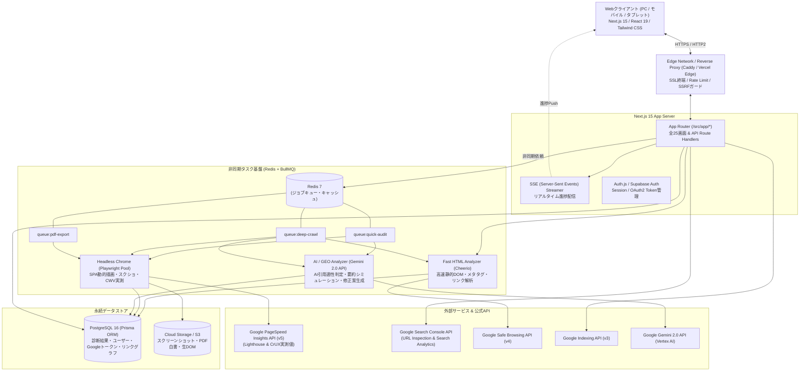
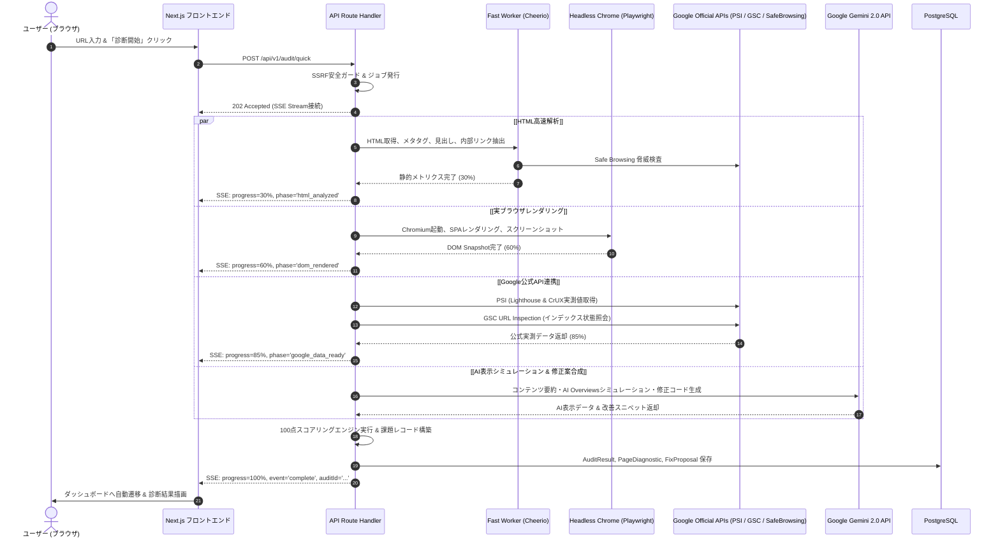

# 01. システム基本設計書 & 全画面一覧 (BASIC DESIGN)

> **プロジェクト名称**: SEO Analyzer  
> **ドキュメント種別**: システム基本設計書（アーキテクチャ・全25画面一覧・業務フロー・非機能要件）  
> **版数**: 2.0.0 (Google公式API & AI表示対応 拡張版)

---

## 1. システム全体アーキテクチャ

本システムは、低遅延なリアルタイム単一URL監査、数千ページ規模の非同期ディープクロール、Google公式API統合、およびAI表示最適化（GEO/LLMO）を統合したハイパフォーマンスWebプラットフォームです。

---

## 2. 全画面一覧 (25 Routes)

本プラットフォームは、一般公開から高度なプロジェクト管理・AIシミュレーターまで全25のルートを提供します。

### ① 一般公開 & 導入導線 (Public & Marketing)
| URLパス | 画面名 | 概要 |
|---|---|---|
| `/` | トップ・即時診断入力画面 | ヒーローエリア、URL入力バー、リアルタイム進捗バー、最新公開診断ランキング |
| `/features` | 機能一覧・仕様 | 100+監査項目、Google公式API連携、AI表示対応の解説 |
| `/pricing` | 料金プラン案内 | Free（単一URL）、Pro（プロジェクト・GSC連携）、Enterprise（API無制限） |
| `/docs` | API・開発者ドキュメント | REST API仕様、Webhook設定、`llms.txt` 導入ガイド |
| `/tools` | 無料SEOツール集 | Schema.orgビルダー、OGPテスター、robots.txtジェネレーターのポータル |
| `/tools/llms-generator` | `llms.txt` スタジオ | 自社URLからAI向けマークダウン `llms.txt` を自動生成・編集・ダウンロード |
| `/tools/schema-builder` | 構造化データビルダー | Article, Organization, FAQPage のJSON-LD視覚的作成ツール |
| `/tools/meta-tester` | SERP & SNSスニペットプレビュー | Google検索結果、Twitter/X、Facebookでの表示シミュレーター |

### ② 診断結果 & 課題詳細 (Diagnostics & Audit Results)
| URLパス | 画面名 | 概要 |
|---|---|---|
| `/audit/[id]` | 総合診断ダッシュボード | 総合スコアメーター、5大カテゴリレーダーチャート、緊急課題一覧 |
| `/audit/[id]/technical` | Technical SEO詳細 | ステータスコード、HTTPS、canonical、インデックス状態詳細 |
| `/audit/[id]/content` | コンテンツ品質詳細 | タイトル/ディスクリプション文字数、見出し階層（H1-H6）、本文量 |
| `/audit/[id]/performance` | Core Web Vitals詳細 | Google PSI実測データ（LCP, INP, CLS, TTFB）、リソース削減提案 |
| `/audit/[id]/structure` | 構造化データ詳細 | JSON-LD構文検査、OGP、Twitterカード、パンくずリスト検証 |
| `/audit/[id]/ai-geo` | AI表示 & GEO詳細 | AI引用適性スコア、ファクト密度、AIスニペットメタタグ判定 |
| `/audit/[id]/simulator` | **AI表示シミュレーター** | **Google AI Overviews / SearchGPT / Perplexity での要約・引用カード再現** |
| `/audit/[id]/issues/[issueId]`| **具体的修正案・Diff詳細** | **Before/After視覚差分、Next.js/HTMLコピペコード、Google公式解説** |
| `/audit/[id]/tree` | DOM & 見出し構造ツリー | ページのHTMLアウトラインと階層エラーのインタラクティブ可視化 |

### ③ 競合比較 & サイト全体クロール (Comparison & Deep Crawl)
| URLパス | 画面名 | 概要 |
|---|---|---|
| `/compare` | 競合ドメイン比較 | 自社と競合最大3サイトの並列診断、レーダーチャート対決、タグ差分表 |
| `/crawl/[id]` | サイト全体クロールサマリー | 内部リンク巡回状況、404リンク切れ一覧、リダイレクトチェーン |
| `/crawl/[id]/graph` | **内部リンクネットワーク図** | **D3.jsによる内部PageRank・リンク構造のForce-directedグラフ** |
| `/crawl/[id]/sitemap` | サイトマップ整合性チェック | 実際の公開ページと `sitemap.xml` の過不足・不整合一覧 |

### ④ プロジェクト管理 & エクスポート (Projects & Reports)
| URLパス | 画面名 | 概要 |
|---|---|---|
| `/projects` | プロジェクト一覧 | 登録ドメイン一覧、平均健全度スコア、定点観測ステータス |
| `/projects/[projectId]` | プロジェクト詳細・推移 | スコアの日次/週次推移グラフ、Core Web Vitals変動履歴 |
| `/projects/[projectId]/settings`| 監視設定・Google連携 | GSC / PSI連携、定期巡回スケジュール、Slack/Email通知設定 |
| `/export/[id]/pdf` | クライアント用PDF白書 | 企業ロゴ・表紙付き診断レポートの印刷・PDF出力プレビュー |

---

## 3. 主要業務シーケンス (Business Flow)

### 3.1 Google公式API + AI表示対応の統合診断フロー

