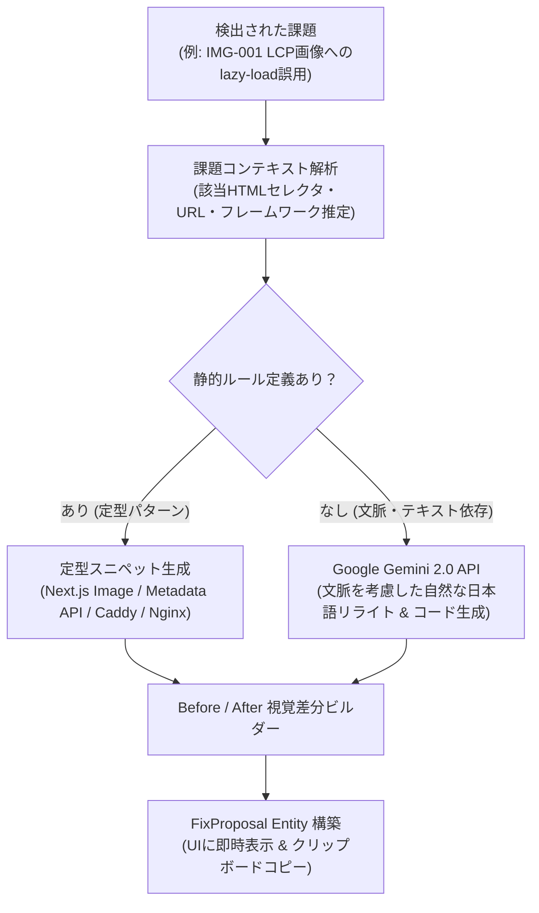

# 02. SEO評価エンジン・スコアリング詳細設計 (SEO ANALYSIS ENGINE)

> **プロジェクト名称**: SEO Analyzer  
> **ドキュメント種別**: 詳細設計書（150+全検査項目マスター・スコアリング数式・JS SEO差分・E-E-A-T・具体的修正案エンジン）  
> **版数**: 3.0.0 (プロフェッショナル完全網羅版)

---

## 1. 総合スコアリングアルゴリズム (The Scoring Model)

総合SEO健全度スコア（$S_{\text{overall}} \in [0, 100]$）は、以下の6大カテゴリの加重平均と、致命的ペナルティ乗数によって算出されます。

### 1.1 カテゴリ配点ウェイト

$$
S_{\text{overall}} = \max\left(0, \min\left(100, \sum_{i=1}^{6} w_i \cdot S_i \right)\right) \times M_{\text{critical}}
$$

| カテゴリ | 略号 | 配点 $w_i$ | 対象領域 |
|---|---|---|---|
| **Technical SEO (技術的健全性)** | $S_{\text{tech}}$ | **25%** | ステータスコード、インデックス制御、Canonical、robots.txt、安全ヘッダー |
| **On-Page & Content (コンテンツ品質)** | $S_{\text{content}}$ | **25%** | Title、Description、見出し構造、本文量、キーワード設計、アンカー多様性 |
| **Performance & CWV (実測UX)** | $S_{\text{perf}}$ | **20%** | Google PSI / CrUX実測値（LCP, INP, CLS, TTFB）、リソース最適化 |
| **JavaScript & DOM Diff (JS SEO)** | $S_{\text{js}}$ | **10%** | Raw HTML vs Rendered DOM差分、SSRハイドレーション、遅延メタ注入 |
| **Structure & E-E-A-T (構造化・信頼性)**| $S_{\text{trust}}$ | **10%** | Schema.org (@graph)、パンくず、運営者情報、特商法、著者プロフィール |
| **GEO & AI表示対応 (AI引用適性)** | $S_{\text{ai}}$ | **10%** | AI Overviews/Perplexity引用定義文、ファクト密度、`llms.txt`、Bot許可 |

> [!IMPORTANT]
> **クリティカルペナルティ乗数 ($M_{\text{critical}}$)**:
> もし「意図しないnoindex誤爆」「複数Canonical競合」「Google Safe Browsingブラックリスト該当」などの致命的欠陥が存在する場合、$M_{\text{critical}} = 0.5$（最大でも総合50点以下に強制制限）が適用されます。

---

## 2. 150+ 検査項目マスター仕様 (Rules Master)

### 2.1 Technical SEO 検査項目 ($S_{\text{tech}}$)
| ルールID | 項目名 | 判定アルゴリズム | 重大度 | 減点 |
|---|---|---|---|---|
| `TECH-001` | HTTPステータス | レスポンスが `200 OK` か（301/302リダイレクトは注意、4xx/5xxは致命的） | 🚨 CRITICAL | -40 (4xx/5xx)<br>-10 (3xx) |
| `TECH-002` | Indexability (noindex) | HTMLおよびヘッダーに意図せぬ `noindex` が設定されていないか | 🚨 CRITICAL | -40 |
| `TECH-003` | Canonicalタグの整合性 | 単一の絶対パスURLが指定され、自己参照または正規URLを指しているか | 🚨 CRITICAL | -30 |
| `TECH-004` | HTTPS & 混在コンテンツ | HTTPS通信であり、HTTPリソース（画像/JS/CSS）の混入がないか | 🚨 CRITICAL | -25 |
| `TECH-005` | robots.txt 構文と配置 | ルート直下に構文エラーなく存在し、Googlebotを遮断していないか | ⚠️ WARNING | -15 |
| `TECH-006` | XMLサイトマップ・ハブ・カノニカル連携 | `robots.txt` のSitemap指示、`/sitemap.xml` 構文・URL上限、トピックハブと子クラスター網羅性、非正規/パラメータ付きURLの混入排除、Hreflang/AMPコンパニオンURLの整合性 | ⚠️ WARNING | -15 |
| `TECH-007` | モバイルフレンドリー Viewport | `width=device-width, initial-scale=1` が指定されズーム禁止がないか | 🚨 CRITICAL | -20 |
| `TECH-008` | リダイレクトチェーン | 転送ホップ数が2回以上連続していないか（A -> B -> C） | ⚠️ WARNING | -10 |
| `TECH-009` | URL構造の正規化 | 末尾スラッシュの有無、パラメータ順序、大文字小文字の混在チェック | ℹ️ NOTICE | -5 |
| `TECH-010` | セキュリティヘッダー | HSTS, X-Content-Type-Options, X-Frame-Options の付与状態 | ℹ️ NOTICE | -5 |

### 2.2 JavaScript SEO & DOM差分 ($S_{\text{js}}$)
| ルールID | 項目名 | 判定アルゴリズム | 重大度 |
|---|---|---|---|
| `JS-001` | **TitleタグのJS書き換え差分** | Raw HTMLとRendered DOMでTitleが異なる（初期HTMLが空またはプレースホルダー） | ⚠️ WARNING (-15) |
| `JS-002` | **Canonicalの遅延挿入** | Raw HTMLに存在せず、JS実行後に初めてCanonicalが挿入されている | 🚨 CRITICAL (-30) |
| `JS-003` | **内部リンクの100% JS依存** | Raw HTML内に `<a>` タグが1つもなく、JSイベントのみで画面遷移している | 🚨 CRITICAL (-25) |
| `JS-004` | **SSRハイドレーションエラー** | コンソールに React Hydration Mismatch エラーが出力されている | ⚠️ WARNING (-15) |
| `JS-005` | **Soft 404 (擬似404)** | HTTP 200を返しているが、画面上に「ページが見つかりません」と表示 | 🚨 CRITICAL (-35) |

### 2.3 画像・メディア最適化 ($S_{\text{perf}}$ / Media)
| ルールID | 項目名 | 判定アルゴリズム | 重大度 |
|---|---|---|---|
| `IMG-001` | **LCP要素へのlazy-load誤用** | 最大描画画像（LCP）に `loading="lazy"` が設定されている（LCPを遅延させるアンチパターン） | 🚨 CRITICAL (-20) |
| `IMG-002` | **width / height 属性欠落** | `` にアスペクト比指定がなく、CLS（レイアウトシフト）を誘発している | ⚠️ WARNING (-12) |
| `IMG-003` | **Alt属性の網羅率** | 装飾目的以外の画像で `alt` 属性が空または未設定の割合が10%超 | ⚠️ WARNING (-10) |
| `IMG-004` | **次世代フォーマット (WebP/AVIF)** | レガシーな巨大JPEG/PNGが使用され、圧縮可能バイト数が200KB超 | ℹ️ NOTICE (-5) |
| `IMG-005` | **レスポンシブ画像 (`srcset`)** | モバイル表示時にも巨大なデスクトップ解像度画像が配信されている | ℹ️ NOTICE (-5) |

### 2.4 内部リンク構造 & PageRank ($S_{\text{content}}$ / Links)
| ルールID | 項目名 | 判定アルゴリズム | 重大度 |
|---|---|---|---|
| `LINK-001` | **クリック階層の深さ (Click Depth)**| トップページから3クリック以内で到達できない深い階層に位置する | ⚠️ WARNING (-10) |
| `LINK-002` | **リンク切れ (Broken Internal Links)**| 内部リンク先が 404 / 500 エラーを返している | 🚨 CRITICAL (-25) |
| `LINK-003` | **曖昧なアンカーテキスト** | 内部リンクのアンカーが「こちら」「詳細」等の意味を持たない単語のみ | ⚠️ WARNING (-10) |
| `LINK-004` | **孤立ページ (Orphan Page)** | サイト内の他ページからリンクが1本も貼られていない | 🚨 CRITICAL (-20) |
| `LINK-005` | **内部リンクの nofollow 誤用** | 自社サイト内リンクに `rel="nofollow"` を設定しリンクジュースを廃棄している | ⚠️ WARNING (-15) |

### 2.5 構造化データ & E-E-A-T 信頼性 ($S_{\text{trust}}$)
| ルールID | 項目名 | 判定アルゴリズム | 重大度 |
|---|---|---|---|
| `TRUST-001` | **Schema.org 必須プロパティ検証**| Article, Product, FAQPage でGoogleリッチリザルト必須項目が欠落 | ⚠️ WARNING (-15) |
| `TRUST-002` | **著者プロフィール & 専門性明記** | 記事内に著者名、経歴、ソーシャルリンク（`Person.sameAs`）が存在するか | ⚠️ WARNING (-15) |
| `TRUST-003` | **運営元・会社概要の明示** | フッター等に会社概要、代表者名、所在地、プライバシーポリシーへのリンクがあるか | ⚠️ WARNING (-10) |
| `TRUST-004` | **一次情報・公的出典リンク** | 統計データや引用において、信頼できる外部ドメインへの参照リンクがあるか | ℹ️ NOTICE (-5) |
| `TRUST-005` | **Schema.org @graph 構文妥当性**| 複数の構造化エンティティが循環参照せず整合したグラフを構成しているか | ℹ️ NOTICE (-5) |

---

## 3. 具体的修正案（Fix Proposal）自動生成エンジンのアーキテクチャ

本システムの中核的差別化要素である「修正案表示エンジン」は、各検出課題に対して以下の3層パイプラインで解決策を動的生成します。



### 3.1 具体的修正案の出力例 (IMG-001: LCP画像遅延ロードの解消)

- **Before (検出されたアンチパターン)**:
  ```html
  <!-- ファーストビューのヒーロー画像なのに loading="lazy" が付与されている -->
  
  ```
- **診断エンジンの解説**:
  > 🚨 **致命的なパフォーマンス欠陥**: ファーストビューに表示される最大コンテンツ（LCP要素）に `loading="lazy"` が設定されているため、ブラウザが画像のダウンロードを意図的に遅延させ、LCPが1.5秒以上悪化しています。
- **After (Next.js App Router 推奨コード)**:
  ```tsx
  // app/page.tsx
  // priority 属性を付与して preload リンクを自動生成させます
  import Image from 'next/image';

  export default function HeroSection() {
    return (
      <div className="relative w-full h-[480px]">
        <Image
          src="/hero-banner.jpg"
          alt="メインビジュアル"
          fill
          priority // 最優先読み込み (fetchpriority="high") を指定
          sizes="(max-width: 768px) 100vw, 1200px"
          className="object-cover"
        />
      </div>
    );
  }
  ```
