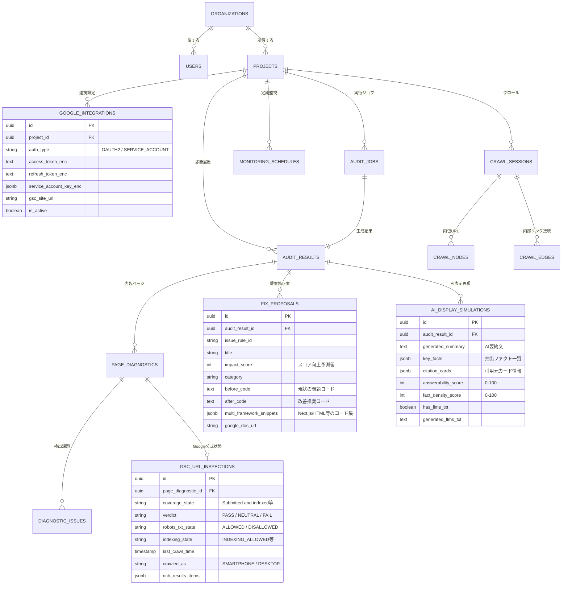

# 03. データベース詳細設計 (DATABASE DESIGN)

> **プロジェクト名称**: SEO Analyzer  
> **ドキュメント種別**: 詳細設計書（ER図・テーブル定義・Prisma Schema・Google連携・AI表示・リンクグラフ）  
> **版数**: 2.0.0 (Google公式API & AI表示対応 拡張版)

---

## 1. データベース全体設計方針

本システムは、高い整合性とACIDトランザクションを誇る **PostgreSQL 16** を主DBとし、ORMには完全型安全な **Prisma ORM** を採用します。
大量の診断生データやDOM属性、Google APIレスポンスは `JSONB` 型を活用して高速インデックス検索を可能にし、リンクグラフ構造は有向グラフテーブル（Nodes / Edges）で表現します。

---

## 2. ER図 (Entity-Relationship Diagram)



---

## 3. Prisma Schema 完全実働コード (`prisma/schema.prisma`)

```prisma
datasource db {
  provider = "postgresql"
  url      = env("DATABASE_URL")
}

generator client {
  provider = "prisma-client-js"
}

enum Plan {
  FREE
  PRO
  ENTERPRISE
}

enum Role {
  ADMIN
  MEMBER
  VIEWER
}

enum JobType {
  QUICK_AUDIT
  DEEP_CRAWL
  COMPETITOR_COMPARE
}

enum JobStatus {
  PENDING
  RUNNING
  COMPLETED
  FAILED
}

enum DeviceType {
  MOBILE
  DESKTOP
}

enum Severity {
  CRITICAL
  WARNING
  NOTICE
  GOOD
}

enum IssueCategory {
  TECHNICAL
  CONTENT
  PERFORMANCE
  STRUCTURE
  GEO
  GOOGLE_OFFICIAL
}

enum GoogleAuthType {
  OAUTH2
  SERVICE_ACCOUNT
}

model Organization {
  id        String    @id @default(uuid()) @db.Uuid
  name      String
  plan      Plan      @default(FREE)
  users     User[]
  projects  Project[]
  createdAt DateTime  @default(now()) @map("created_at")
  updatedAt DateTime  @updatedAt @map("updated_at")

  @@map("organizations")
}

enum AuthProvider {
  LOCAL
  GOOGLE
}

model User {
  id             String       @id @default(uuid()) @db.Uuid
  orgId          String       @map("org_id") @db.Uuid
  organization   Organization @relation(fields: [orgId], references: [id], onDelete: Cascade)
  email          String       @unique
  name           String
  passwordHash   String?      @map("password_hash") // メール+パスワード認証時 (PBKDF2/Argon2)
  provider       AuthProvider @default(LOCAL)
  googleId       String?      @unique @map("google_id") // Google OAuth認証時
  avatarUrl      String?      @map("avatar_url")
  role           Role         @default(MEMBER)
  createdAt      DateTime     @default(now()) @map("created_at")
  updatedAt      DateTime     @updatedAt @map("updated_at")

  @@index([orgId])
  @@map("users")
}

model Project {
  id                   String                 @id @default(uuid()) @db.Uuid
  orgId                String                 @map("org_id") @db.Uuid
  organization         Organization           @relation(fields: [orgId], references: [id], onDelete: Cascade)
  userId               String?                @map("user_id") @db.Uuid // 作成者・所有アカウント紐付け
  user                 User?                  @relation(fields: [userId], references: [id], onDelete: SetNull)
  name                 String
  targetDomain         String                 @map("target_domain")
  rootUrl              String                 @map("root_url")
  isActive             Boolean                @default(true) @map("is_active")
  googleIntegration    GoogleIntegration?
  auditJobs            AuditJob[]
  auditResults         AuditResult[]
  crawlSessions        CrawlSession[]
  monitoringSchedules  MonitoringSchedule[]
  createdAt            DateTime               @default(now()) @map("created_at")
  updatedAt            DateTime               @updatedAt @map("updated_at")

  @@index([orgId])
  @@index([userId])
  @@index([targetDomain])
  @@map("projects")
}

model GoogleIntegration {
  id                    String         @id @default(uuid()) @db.Uuid
  projectId             String         @unique @map("project_id") @db.Uuid
  project               Project        @relation(fields: [projectId], references: [id], onDelete: Cascade)
  authType              GoogleAuthType @default(OAUTH2) @map("auth_type")
  accessTokenEnc        String?        @map("access_token_enc")
  refreshTokenEnc       String?        @map("refresh_token_enc")
  serviceAccountKeyEnc  String?        @map("service_account_key_enc")
  gscSiteUrl            String?        @map("gsc_site_url")
  tokenExpiresAt        DateTime?      @map("token_expires_at")
  isActive              Boolean        @default(true) @map("is_active")
  createdAt             DateTime       @default(now()) @map("created_at")
  updatedAt             DateTime       @updatedAt @map("updated_at")

  @@map("google_integrations")
}

model AuditJob {
  id              String       @id @default(uuid()) @db.Uuid
  projectId       String?      @map("project_id") @db.Uuid
  project         Project?     @relation(fields: [projectId], references: [id], onDelete: SetNull)
  jobType         JobType      @map("job_type")
  status          JobStatus    @default(PENDING)
  progressPercent Int          @default(0) @map("progress_percent")
  progressMeta    Json?        @map("progress_meta")
  auditResult     AuditResult?
  startedAt       DateTime?    @map("started_at")
  completedAt     DateTime?    @map("completed_at")
  createdAt       DateTime     @default(now()) @map("created_at")

  @@index([projectId, status])
  @@index([status, createdAt])
  @@map("audit_jobs")
}

model AuditResult {
  id                   String                 @id @default(uuid()) @db.Uuid
  jobId                String                 @unique @map("job_id") @db.Uuid
  auditJob             AuditJob               @relation(fields: [jobId], references: [id], onDelete: Cascade)
  projectId            String?                @map("project_id") @db.Uuid
  project              Project?               @relation(fields: [projectId], references: [id], onDelete: SetNull)
  auditedUrl           String                 @map("audited_url")
  deviceType           DeviceType             @default(MOBILE) @map("device_type")
  overallScore         Int                    @map("overall_score")
  technicalScore       Int                    @map("technical_score")
  contentScore         Int                    @map("content_score")
  performanceScore     Int                    @map("performance_score")
  structureScore       Int                    @map("structure_score")
  geoScore             Int                    @map("geo_score")
  aiDisplayScore       Int                    @default(0) @map("ai_display_score")
  criticalCount        Int                    @default(0) @map("critical_count")
  warningCount         Int                    @default(0) @map("warning_count")
  noticeCount          Int                    @default(0) @map("notice_count")
  screenshotUrl        String?                @map("screenshot_url")
  pageDiagnostics      PageDiagnostic[]
  fixProposals         FixProposal[]
  aiDisplaySimulations AiDisplaySimulation[]
  createdAt            DateTime               @default(now()) @map("created_at")

  @@index([projectId, createdAt(sort: Desc)])
  @@index([auditedUrl])
  @@map("audit_results")
}

model PageDiagnostic {
  id                  String             @id @default(uuid()) @db.Uuid
  auditResultId       String             @map("audit_result_id") @db.Uuid
  auditResult         AuditResult        @relation(fields: [auditResultId], references: [id], onDelete: Cascade)
  url                 String
  httpStatus          Int                @map("http_status")
  responseTimeMs      Float              @map("response_time_ms")
  title               String?
  metaDescription     String?            @map("meta_description")
  canonicalUrl        String?            @map("canonical_url")
  robotsDirective     String?            @map("robots_directive")
  h1Count             Int                @default(0) @map("h1_count")
  wordCount           Int                @default(0) @map("word_count")
  internalLinksCount  Int                @default(0) @map("internal_links_count")
  externalLinksCount  Int                @default(0) @map("external_links_count")
  lcpSeconds          Float?             @map("lcp_seconds")
  inpMilliseconds     Float?             @map("inp_milliseconds")
  clsScore            Float?             @map("cls_score")
  hasJsonLd           Boolean            @default(false) @map("has_json_ld")
  rawDomMetrics       Json?              @map("raw_dom_metrics")
  gscInspection       GscUrlInspection?
  diagnosticIssues    DiagnosticIssue[]
  createdAt           DateTime           @default(now()) @map("created_at")

  @@index([auditResultId])
  @@index([url])
  @@map("page_diagnostics")
}

model GscUrlInspection {
  id                  String         @id @default(uuid()) @db.Uuid
  pageDiagnosticId    String         @unique @map("page_diagnostic_id") @db.Uuid
  pageDiagnostic      PageDiagnostic @relation(fields: [pageDiagnosticId], references: [id], onDelete: Cascade)
  coverageState       String         @map("coverage_state") // 例: "Submitted and indexed"
  verdict             String         // "PASS" / "NEUTRAL" / "FAIL"
  robotsTxtState      String         @map("robots_txt_state") // "ALLOWED" / "DISALLOWED"
  indexingState       String         @map("indexing_state")
  crawledAs           String         @map("crawled_as") // "SMARTPHONE" / "DESKTOP"
  lastCrawlTime       DateTime?      @map("last_crawl_time")
  richResultsItems    Json?          @map("rich_results_items")
  createdAt           DateTime       @default(now()) @map("created_at")

  @@map("gsc_url_inspections")
}

model DiagnosticIssue {
  id                    String         @id @default(uuid()) @db.Uuid
  pageDiagnosticId      String         @map("page_diagnostic_id") @db.Uuid
  pageDiagnostic        PageDiagnostic @relation(fields: [pageDiagnosticId], references: [id], onDelete: Cascade)
  ruleId                String         @map("rule_id")
  category              IssueCategory
  severity              Severity
  title                 String
  message               String
  scorePenalty          Int            @default(0) @map("score_penalty")
  targetElement         String?        @map("target_element")
  recommendedFix        String?        @map("recommended_fix")
  generatedCodeSnippet  String?        @map("generated_code_snippet")
  createdAt             DateTime       @default(now()) @map("created_at")

  @@index([pageDiagnosticId, severity])
  @@index([ruleId])
  @@map("diagnostic_issues")
}

model FixProposal {
  id                     String      @id @default(uuid()) @db.Uuid
  auditResultId          String      @map("audit_result_id") @db.Uuid
  auditResult            AuditResult @relation(fields: [auditResultId], references: [id], onDelete: Cascade)
  issueRuleId            String      @map("issue_rule_id")
  title                  String
  impactScore            Int         @map("impact_score")
  category               String
  description            String
  beforeCode             String      @map("before_code")
  afterCode              String      @map("after_code")
  multiFrameworkSnippets Json        @map("multi_framework_snippets")
  googleDocUrl           String?     @map("google_doc_url")
  createdAt              DateTime    @default(now()) @map("created_at")

  @@index([auditResultId])
  @@map("fix_proposals")
}

model AiDisplaySimulation {
  id                  String      @id @default(uuid()) @db.Uuid
  auditResultId       String      @map("audit_result_id") @db.Uuid
  auditResult         AuditResult @relation(fields: [auditResultId], references: [id], onDelete: Cascade)
  generatedSummary    String      @map("generated_summary")
  keyFacts            Json        @map("key_facts")
  citationCards       Json        @map("citation_cards")
  answerabilityScore  Int         @map("answerability_score")
  factDensityScore    Int         @map("fact_density_score")
  hasLlmsTxt          Boolean     @default(false) @map("has_llms_txt")
  generatedLlmsTxt    String?     @map("generated_llms_txt")
  createdAt           DateTime    @default(now()) @map("created_at")

  @@index([auditResultId])
  @@map("ai_display_simulations")
}

model CrawlSession {
  id              String       @id @default(uuid()) @db.Uuid
  projectId       String       @map("project_id") @db.Uuid
  project         Project      @relation(fields: [projectId], references: [id], onDelete: Cascade)
  startUrl        String       @map("start_url")
  maxPages        Int          @default(500) @map("max_pages")
  totalPages      Int          @default(0) @map("total_pages")
  brokenLinks     Int          @default(0) @map("broken_links")
  nodes           CrawlNode[]
  edges           CrawlEdge[]
  createdAt       DateTime     @default(now()) @map("created_at")

  @@index([projectId])
  @@map("crawl_sessions")
}

model CrawlNode {
  id             String       @id @default(uuid()) @db.Uuid
  crawlSessionId String       @map("crawl_session_id") @db.Uuid
  crawlSession   CrawlSession @relation(fields: [crawlSessionId], references: [id], onDelete: Cascade)
  url            String
  httpStatus     Int          @map("http_status")
  depth          Int
  inLinksCount   Int          @default(0) @map("in_links_count")
  outLinksCount  Int          @default(0) @map("out_links_count")
  pageRankScore  Float        @default(1.0) @map("page_rank_score")

  @@index([crawlSessionId, url])
  @@map("crawl_nodes")
}

model CrawlEdge {
  id             String       @id @default(uuid()) @db.Uuid
  crawlSessionId String       @map("crawl_session_id") @db.Uuid
  crawlSession   CrawlSession @relation(fields: [crawlSessionId], references: [id], onDelete: Cascade)
  sourceUrl      String       @map("source_url")
  targetUrl      String       @map("target_url")
  anchorText     String?      @map("anchor_text")
  isNofollow     Boolean      @default(false) @map("is_nofollow")

  @@index([crawlSessionId])
  @@map("crawl_edges")
}

model MonitoringSchedule {
  id                     String    @id @default(uuid()) @db.Uuid
  projectId              String    @map("project_id") @db.Uuid
  project                Project   @relation(fields: [projectId], references: [id], onDelete: Cascade)
  frequency              String    @default("WEEKLY")
  targetUrl              String    @map("target_url")
  alertThresholdScore    Int       @default(70) @map("alert_threshold_score")
  notificationChannels   String    @default("EMAIL") @map("notification_channels")
  webhookUrl             String?   @map("webhook_url")
  isEnabled              Boolean   @default(true) @map("is_enabled")
  lastRunAt              DateTime? @map("last_run_at")
  nextRunAt              DateTime? @map("next_run_at")
  createdAt              DateTime  @default(now()) @map("created_at")

  @@index([isEnabled, nextRunAt])
  @@map("monitoring_schedules")
}
```
