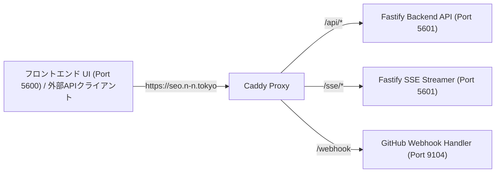

# 04. API詳細仕様書 (API SPECIFICATION)

> **プロジェクト名称**: SEO Analyzer  
> **ドキュメント種別**: 詳細設計書（REST API・SSEリアルタイム通信・型定義・エラーハンドリング）  
> **バックエンド基幹ポート**: `127.0.0.1:5601` (Fastify / Node.js 22 LTS)  
> **ベースURL**: `/api/v1` (SSEストリーム: `/sse/*`)  
> **版数**: 2.2.0 (バックエンド/フロントエンド分離 & Webhook自動デプロイ対応版)

---

## 1. サービスポート & ルーティング仕様

本システムのAPI群は、独立したバックエンドプロセス（`seo-backend` / ポート `5601`）によって高速処理されます。Caddyにより、外部クライアントからは同一ドメイン（`https://seo.n-n.tokyo/api/*` および `https://seo.n-n.tokyo/sse/*`）として透過的に利用できます。

---

## 2. エンドポイント完全マトリクス

### ① 診断 & メタ不具合 & AI表示 (Audits & Meta Inspector)
| メソッド | パス | 説明 | 認証 |
|---|---|---|---|
| `POST` | `/api/v1/audit/quick` | 単一URL即時診断開始（Job発行） | 任意 (Rate Limit有) |
| `GET` | `/sse/audit/:jobId` | SSEリアルタイム診断進捗ストリーミング | 不要 |
| `GET` | `/api/v1/audit/results/:id` | 診断総合スコア・全課題サマリー取得 | 任意 |
| `GET` | `/api/v1/audit/:id/meta-defects`| **メタタグ不具合・重複・文字化け詳細一覧** | 任意 |
| `GET` | `/api/v1/audit/:id/dom-diff` | **Raw HTML vs Rendered DOM 差分解析結果** | 任意 |
| `GET` | `/api/v1/audit/:id/ai-preview` | **Google AI Overviews / Perplexity プレビュー再現** | 任意 |
| `GET` | `/api/v1/audit/:id/proposals` | **具体的修正案・Before/Afterコード一覧** | 任意 |

### ② ディープクロール & リンクグラフ (Crawler & Graph)
| メソッド | パス | 説明 | 認証 |
|---|---|---|---|
| `POST` | `/api/v1/crawl/start` | サイト全体ディープクロールセッションの開始 | 必須 |
| `POST` | `/api/v1/crawl/:sessionId/pause` | クロールの一時停止（チェックポイント保存） | 必須 |
| `POST` | `/api/v1/crawl/:sessionId/resume`| 中断されたクロールセッションの再開 | 必須 |
| `GET` | `/sse/crawl/:sessionId` | クロール進捗リアルタイムストリーム | 必須 |
| `GET` | `/api/v1/crawl/:sessionId/status`| 巡回進捗・処理ページ数・404件数 | 必須 |
| `GET` | `/api/v1/crawl/:sessionId/graph` | **D3.js用 内部リンク有向グラフ (Nodes / Edges)** | 必須 |
| `GET` | `/api/v1/crawl/:sessionId/broken`| リンク切れ（404/500）およびリンク元一覧 | 必須 |

### ③ プロジェクト管理 & 履歴差分 (Projects & Time-Travel Diff)
| メソッド | パス | 説明 | 認証 |
|---|---|---|---|
| `GET` | `/api/v1/projects` | 登録ドメイン・プロジェクト一覧 | 必須 |
| `POST` | `/api/v1/projects` | 新規ドメイン監視プロジェクトの登録 | 必須 |
| `GET` | `/api/v1/projects/:id/history` | スコア・Core Web Vitalsの日次推移データ | 必須 |
| `GET` | `/api/v1/projects/:id/diff` | **前回診断とのメタタグ・スコア変動差分比較** | 必須 |
| `POST` | `/api/v1/projects/:id/notify/test`| Slack / Webhook テスト通知送信 | 必須 |

### ④ Google公式API連携 (Google Official Integrations)
| メソッド | パス | 説明 | 認証 |
|---|---|---|---|
| `GET` | `/api/v1/integrations/google/auth-url` | Google OAuth2 認証開始URL取得（ブラウザ別セッション開始） | 不要 |
| `GET` | `/api/v1/integrations/google/callback` | OAuth2 コールバック処理 & 暗号化セッショントークン発行 | 不要 |
| `GET` | `/api/v1/integrations/google/session` | 現在のブラウザのGoogle連携ステータス照会 | セッションID |
| `POST` | `/api/v1/integrations/google/disconnect`| 現在のブラウザのGoogle連携解除 & トークン完全破棄 | セッションID |
| `POST` | `/api/v1/google/hub-data` | **PSI・CrUX・GSC・GA4・Gemini 統合データ一括照会** | 任意 (未連携時は未取得表示) |
| `POST` | `/api/v1/integrations/google/service-account` | サービスアカウントJSONキーの登録 | 必須 |
| `POST` | `/api/v1/google/inspect` | **GSC URL Inspection API 即時照会** | セッションID |
| `POST` | `/api/v1/google/index-publish` | **Google Indexing API 即時巡回通知** | セッションID |

### ⑤ ツール & エクスポート (Tools & Reports)
| メソッド | パス | 説明 | 認証 |
|---|---|---|---|
| `POST` | `/api/v1/tools/generate-llms-txt` | 対象サイトの構造から `llms.txt` を自動合成 | 任意 |
| `GET` | `/api/v1/reports/:auditId/pdf` | ホワイトラベルPDFレポートのバイナリ出力 | 任意 |
| `GET` | `/api/health` | バックエンド死活監視エンドポイント (200 OK) | 不要 |

### ⑥ インフラ・自動デプロイ (Webhook)
| メソッド | パス | 説明 | 認証 |
|---|---|---|---|
| `POST` | `/webhook` | GitHub Push イベント受信 & ゼロダウンタイムデプロイキック | HMAC-SHA256署名 |
| `GET` | `/webhook/health` | Webhookサーバー死活監視 | 不要 |
