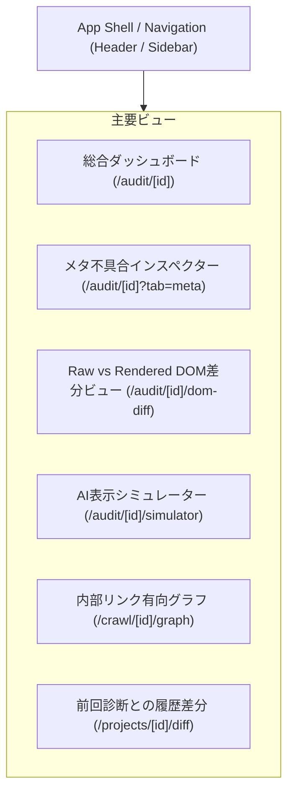

# 05. UI/UX・画面詳細設計書 (UI/UX DESIGN)

> **プロジェクト名称**: SEO Analyzer  
> **ドキュメント種別**: 詳細設計書（画面レイアウト・ワイヤーフレーム・DOM差分ビュー・メタ不具合検査UI・リンクグラフ可視化）  
> **版数**: 2.0.0 (プロフェッショナル完全網羅版)

---

## 1. デザインシステム & 画面コンポーネント構成

本システムは、LinearやVercelに代表される極めて洗練された開発者・アナリスト向けダークUI（[`DESIGN.md`](../DESIGN.md) 準拠）をベースとし、大量の技術データをノイズなく一目で把握できるUI/UXを提供します。



---

## 2. 特化ビューの詳細ワイヤーフレーム

### 2.1 メタ不具合インスペクター (`/audit/[id]?tab=meta`)
メタタグの重複、文字化け、Canonicalの不整合、SNS画像の不備を一箇所で監査できる専用ビューです。

```
+-------------------------------------------------------------------------------+
| [LOGO] SEO Analyzer  >  https://example.com/  >  メタ情報・タグ整合性監査      |
+-------------------------------------------------------------------------------+
|  【メタ健全度スコア: 68/100】  🚨 致命的重複: 1件  ⚠️ 整合性警告: 2件          |
|                                                                               |
|  --- 🚨 検出された重大なメタ不具合 -----------------------------------------  |
|  +--------------------------------------------------------------------------+ |
|  | 🚨 [META-001] Canonicalタグの重複競合 (2件検出)                          | |
|  |                                                                          | |
|  |  検出1 (行 12): <link rel="canonical" href="https://example.com/item">   | |
|  |  検出2 (行 45): <link rel="canonical" href="https://example.com/item?c=1">|
|  |                                                                          | |
|  |  🔍 影響: Googlebotは競合するCanonicalを完全に破棄し、意図せぬURLが正規化  | |
|  |           される危険があります。                                         | |
|  |                                                [ 💻 修正コードを表示 ]   | |
|  +--------------------------------------------------------------------------+ |
|                                                                               |
|  --- ⚠️ OGP・SNS画像メタの警告 --------------------------------------------   |
|  +--------------------------------------------------------------------------+ |
|  | ⚠️ [META-014] og:image が相対パスで指定されています                     | |
|  |  検出値: <meta property="og:image" content="/images/ogp.jpg">            | |
|  |  解決策: Twitter / Facebookの仕様上、完全な絶対URL (https://...) が必須です | |
|  |                                                [ 📋 推奨タグをコピー ]   | |
|  +--------------------------------------------------------------------------+ |
+-------------------------------------------------------------------------------+
```

---

### 2.2 Raw HTML vs Rendered DOM 差分ビュー (`/audit/[id]/dom-diff`)
JavaScript実行前後のメタタグ変化を並列で可視化する業界初のインスペクターです。

```
+-------------------------------------------------------------------------------+
| 🔍 Raw HTML (静的取得時) VS Rendered DOM (JS実行後) 差分アナライザー           |
+-------------------------------------------------------------------------------+
| ステータス: ⚠️ タイトルの書き換え差分および遅延Canonicalが検出されました        |
|                                                                               |
| +------------------------------------+-------------------------------------+  |
| | 📄 Raw HTML (Googlebot初期取得)     | 🖥️ Rendered DOM (JSハイドレーション後) |  |
| +------------------------------------+-------------------------------------+  |
| | <title>Create Next App</title>     | <title>SEO Analyzer｜公式</title>   |  |
| |                                    |                                     |  |
| | <!-- Canonical なし -->            | <link rel="canonical" href="...">  |  |
| |                                    |                                     |  |
| | 内部リンク: <a> タグ 0件 (空)      | 内部リンク: <a> タグ 48件 (描画済)  |  |
| +------------------------------------+-------------------------------------+  |
| 💡 改善ガイダンス: Next.jsのMetadata APIを用い、サーバーサイド（SSR）段階で    |
|    正確なタイトル・Canonicalを出力する設計に修正してください。               |
+-------------------------------------------------------------------------------+
```

---

### 2.3 内部リンク Force-Directed グラフ (`/crawl/[id]/graph`)
D3.jsおよびCanvasを用いたインタラクティブなリンクネットワーク可視化画面です。

```
+-------------------------------------------------------------------------------+
| 🕸️ 内部リンク構造ネットワーク図 (全 342 ページ)      [フィルタ: 404のみ表示] |
+-------------------------------------------------------------------------------+
|                                                                               |
|            ( / ) [大型ノード: トップページ]                                    |
|             /  \                                                              |
|            /    \                                                             |
|     ( /docs )  ( /blog ) ----- ( /blog/seo-guide )                            |
|        |           |                  \                                       |
|        |           |                   \                                      |
|     ( /api )    ( /pricing )           [🔴 404 リンク切れノード]              |
|                                                                               |
|  [凡例]                                                                       |
|  🟢 200 OK (正常)   🟠 301 リダイレクト   🔴 404 リンク切れ   ⚪ 孤立ページ    |
|  ※ ノードの半径 = 内部PageRank（被リンク集中度）                                |
+-------------------------------------------------------------------------------+
```

---

### 2.4 前回診断との履歴差分比較 (`/projects/[id]/diff`)
デプロイや施策実施によって「何が改善し、何が悪化したか」のTime-travel比較ビューです。

```
+-------------------------------------------------------------------------------+
| ⏱️ 履歴差分比較: 2026/08/30 診断  VS  2026/09/06 診断 (本日)                 |
+-------------------------------------------------------------------------------+
| 総合スコア変動: 78点 ➔ 91点 (+13点 改善 🎉)                                   |
|                                                                               |
|  ✅ 解決された課題 (3件):                                                     |
|  • [CONT-001] タイトルタグ文字数の最適化 (48文字 ➔ 31文字)                    |
|  • [META-001] Canonical重複の解消                                             |
|  • [PERF-001] LCPヒーロー画像の priority 属性付与による描画高速化 (3.4s ➔ 1.8s)|
|                                                                               |
|  🚨 新たに発生した課題 (0件): なし                                            |
+-------------------------------------------------------------------------------+
```
