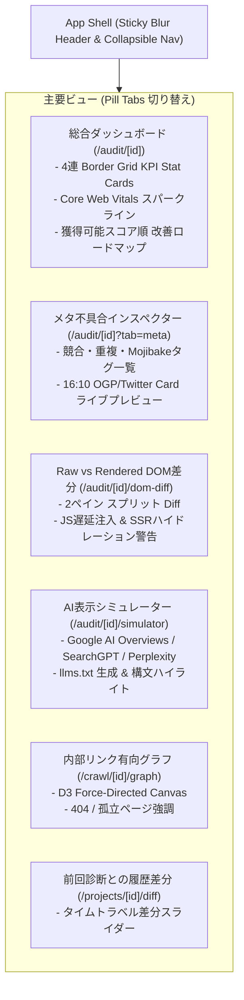

# 05. UI/UX・画面詳細設計書 (UI/UX DESIGN)

> **プロジェクト名称**: SEO Analyzer  
> **ドキュメント種別**: 詳細設計書（画面レイアウト・ワイヤーフレーム・DOM差分ビュー・メタ不具合検査UI・リンクグラフ可視化）  
> **デザインリファレンス**:  
> - [ShadcnAdmin](https://shadcnadmin.com/) (Radix Primitives, Tailwind CSS v4, OKLCH, Border Grids, Stat Cards, DataTables)  
> - [Refero Styles](https://styles.refero.design/) (AI-Native DESIGN.md Standard, Obsidian Gallery Dark Aesthetic, 16:10 Media Containers, Pill Tabs)  
> **版数**: 2.1.0 (ShadcnAdmin & Refero 統合プロフェッショナル版)

---

## 1. デザインシステム & 画面コンポーネント構成

本システムは、LinearやVercelに代表される洗練された開発者・アナリスト向けダークUI（[`DESIGN.md`](../DESIGN.md) 準拠）をベースとし、`shadcnadmin.com` のダッシュボードレイアウト（ボーダーグリッド、KPIスタットカード、ファセット絞り込みDataTable）と、`styles.refero.design` の黒曜石ギャラリースタイル、ピル型タブナビゲーション、16:10メディアコンテナを完全統合しています。



---

## 2. 特化ビューの詳細ワイヤーフレーム & UI仕様

### 2.1 総合ダッシュボード (`/audit/[id]`)
ShadcnAdminのボーダーグリッド（`grid gap-px bg-border/40 rounded-3xl overflow-hidden`）を採用したKPIトップバーとピル型ナビゲーション：

```
+---------------------------------------------------------------------------------------------------+
|  [LOGO] SEO Analyzer   https://example.com/               [ Cmd+K 診断 ]   [ 📥 レポート出力 (PDF) ]  |
+---------------------------------------------------------------------------------------------------+
|                                                                                                   |
|  [ ピル型タブ切り替え: ( 総合診断 )  ( メタ不具合 )  ( DOM差分 )  ( AI表示/GEO )  ( 内部リンク ) ]   |
|                                                                                                   |
|  +---------------------+---------------------+---------------------+---------------------------+  |
|  | TOTAL SEO SCORE     | PERFORMANCE (PSI)   | META INTEGRITY      | AI / GEO READY            |  |
|  |    92 / 100         |    98 / 100         |    64 / 100         |    85 / 100               |  |
|  |  🟢 +8pts vs 前回   |  🟢 LCP 1.2s (Good) |  ⚠️ 3 Issues        |  ✨ 引用確率: 78%         |  |
|  |  [~~~ Sparkline ~]  |  [~~~ Sparkline ~]  |  [~~~ Sparkline ~]  |  [~~~ Sparkline ~]        |  |
|  +---------------------+---------------------+---------------------+---------------------------+  |
|                                                                                                   |
|  --- 🚀 獲得スコア順 具体的改善アクション (改善で +16点 獲得見込み) ----------------------------  |
|  +---------------------------------------------------------------------------------------------+  |
|  | 🚨 [CRITICAL] Canonicalタグの重複競合 (2件検出)                              [ 獲得見込み: +10点 ]|
|  | 影響: Googlebotが正規化URLを判定できず、重複コンテンツとしてインデックス除外される危険があります。 |
|  |                                                                                             |  |
|  | +-- [ 差分プレビュー ] ------------------------------------+-- [ 推奨コード (Next.js) ] ------+|  |
|  | | - <link rel="canonical" href="https://example.com/item"> | export const metadata = {      ||  |
|  | | - <link rel="canonical" href="https://example.com/item?1>|   alternates: {                ||  |
|  | |                                                          |     canonical: '/item',        ||  |
|  | |                                                          |   }                            ||  |
|  | |                                                          | }                              ||  |
|  | +----------------------------------------------------------+--------------------------------+|  |
|  |                                                [ 📋 Next.jsコードをコピー ] [ 📚 Google公式 ] |  |
|  +---------------------------------------------------------------------------------------------+  |
+---------------------------------------------------------------------------------------------------+
```

---

### 2.2 メタ不具合インスペクター (`/audit/[id]?tab=meta`)
Referoの16:10プレビュー枠（`aspect-[16/10] rounded-2xl`）を組み込み、OGP/Twitterカードの実描画状態とメタ構文エラーを検証。

```
+---------------------------------------------------------------------------------------------------+
|  メタ健全度スコア: 64/100   🚨 致命的重複: 1件   ⚠️ 整合性警告: 2件   ℹ️ 推奨対応: 4件              |
+---------------------------------------------------------------------------------------------------+
|  [ 16:10 SNSシェア・カード ライブプレビュー (Refero Style) ]                                      |
|  +------------------------------------------------------+  +-- 検出されたメタ不具合一覧 ------+   |
|  | [ 16:10 OGP 画像プレビュー領域 (1200 x 630)]         |  | 🚨 Canonical重複競合 (2件)       |   |
|  |                                                      |  | ⚠️ og:image が相対パス指定       |   |
|  | ---------------------------------------------------- |  | ⚠️ twitter:card 未指定 (Summary) |   |
|  | タイトル: SEO Analyzer｜最高峰のSEO監査ツール        |  | ℹ️ description が160文字超過     |   |
|  | ドメイン: seo.n-n.tokyo                              |  |                                  |   |
|  +------------------------------------------------------+  +----------------------------------+   |
|                                                                                                   |
|  【文字コード・Mojibake検査】: UTF-8 正常（BOMなし・UTF-8宣言は先頭512バイト以内に配置済み ✅）    |
+---------------------------------------------------------------------------------------------------+
```

---

### 2.3 Raw HTML vs Rendered DOM 差分ビュー (`/audit/[id]/dom-diff`)
JavaScript実行前後のメタタグ変化を並列で可視化するスプリットコードビュー（ShadcnAdminスタイル）。

```
+---------------------------------------------------------------------------------------------------+
| 🔍 Raw HTML (静的取得時) VS Rendered DOM (JS実行後) 差分アナライザー                              |
+---------------------------------------------------------------------------------------------------+
| ステータス: ⚠️ タイトルのクライアント書き換え 及び 遅延Canonical注入が検出されました             |
|                                                                                                   |
| +-- 📄 Raw HTML (Googlebot初期取得) ------------+-- 🖥️ Rendered DOM (JSハイドレーション後) --------+ |
| | <title>Create Next App</title>                | <title>SEO Analyzer｜公式</title>              | |
| |                                               |                                                | |
| | <!-- Canonical なし -->                       | <link rel="canonical" href="...">             | |
| |                                               |                                                | |
| | 内部リンク: <a> タグ 0件 (SSR未描画)           | 内部リンク: <a> タグ 48件 (クライアント描画済) | |
| +-----------------------------------------------+------------------------------------------------+ |
| 💡 改善ガイダンス: Next.jsのMetadata APIを用い、サーバーサイド（SSR）段階で正確なタグを出力してください|
+---------------------------------------------------------------------------------------------------+
```

---

### 2.4 AI表示シミュレーター (`/audit/[id]/simulator`)
Google AI Overviews、SearchGPT、Perplexityでの要約・引用カードを忠実再現するプレビューカード。

```
+---------------------------------------------------------------------------------------------------+
| 🤖 AI表示・引用シミュレーター (GEO / LLMO Engine)                   [ llms.txt 自動生成 📥 ]       |
+---------------------------------------------------------------------------------------------------+
|                                                                                                   |
|  +-- [ Google AI Overviews プレビュー ] --------------------------------------------------------+ |
|  | ✨ 生成要約:                                                                                 | |
|  | 本サービスは、Google公式APIと連携し、Core Web VitalsやCanonicalタグの整合性を自動診断する    | |
|  | 次世代型SEO監査プラットフォームです。                                                       | |
|  |                                                                                              | |
|  | 引用ソースカード:                                                                           | |
|  | +-----------------------------+  +-----------------------------+                             | |
|  | | [Favicon] seo.n-n.tokyo     |  | [Favicon] docs.example.com  |                             | |
|  | | SEO Analyzer 特徴と導入事例 |  | 技術仕様書・公式ドキュメント|                             | |
|  | +-----------------------------+  +-----------------------------+                             | |
|  +----------------------------------------------------------------------------------------------+ |
|                                                                                                   |
|  【AIクローラー対応状況】:                                                                        |
|  • GPTBot (ChatGPT): 許可 (200 OK) ✅                                                             |
|  • PerplexityBot: 許可 (200 OK) ✅                                                                |
|  • Google-Extended (Gemini Training): 許可 (200 OK) ✅                                            |
|  • max-snippet: -1 (全文抜粋許可): 設定済み ✅                                                    |
+---------------------------------------------------------------------------------------------------+
```

---

### 2.5 内部リンク Force-Directed グラフ (`/crawl/[id]/graph`)
D3.jsおよびCanvasを用いたインタラクティブなリンクネットワーク可視化画面。

```
+---------------------------------------------------------------------------------------------------+
| 🕸️ 内部リンク構造ネットワーク図 (全 342 ページ)                      [フィルタ: 🔴 404のみ表示]   |
+---------------------------------------------------------------------------------------------------+
|                                                                                                   |
|            ( / ) [大型ノード: トップページ]                                                       |
|             /  \                                                                                  |
|            /    \                                                                                 |
|     ( /docs )  ( /blog ) ----- ( /blog/seo-guide )                                                |
|        |           |                  \                                                           |
|        |           |                   \                                                          |
|     ( /api )    ( /pricing )           [🔴 404 リンク切れノード]                                  |
|                                                                                                   |
|  [凡例] 🟢 200 OK (正常)   🟠 301 リダイレクト   🔴 404 リンク切れ   ⚪ 孤立ページ                |
|  ※ ノードの半径 = 内部PageRank（被リンク集中度）                                                    |
+---------------------------------------------------------------------------------------------------+
```

---

### 2.6 前回診断との履歴差分比較 (`/projects/[id]/diff`)
デプロイや施策実施によって「何が改善し、何が悪化したか」のTime-travel比較ビュー。

```
+---------------------------------------------------------------------------------------------------+
| ⏱️ 履歴差分比較: 2026/08/30 診断  VS  2026/09/06 診断 (本日)                                    |
+---------------------------------------------------------------------------------------------------+
| 総合スコア変動: 78点 ➔ 91点 (+13点 改善 🎉)                                                      |
|                                                                                                   |
|  ✅ 解決された課題 (3件):                                                                         |
|  • [CONT-001] タイトルタグ文字数の最適化 (48文字 ➔ 31文字)                                        |
|  • [META-001] Canonical重複の解消                                                                 |
|  • [PERF-001] LCPヒーロー画像の priority 属性付与による描画高速化 (3.4s ➔ 1.8s)                    |
|                                                                                                   |
|  🚨 新たに発生した課題 (0件): なし                                                                |
+---------------------------------------------------------------------------------------------------+
```

---

### 2.7 プロジェクト統合ハブ・実行機能ダッシュボード (`/projects/[id]`) [SCR-16]
プロジェクト詳細画面は、単なる履歴リストにとどまらず、登録ドメインに対する**全機能の実行・結果表示ハブ**として動作します。

```
+---------------------------------------------------------------------------------------------------+
| 📁 自社オウンドメディア (example.com)                   [ 🔄 今すぐこのドメインを再診断 ]         |
| 最新総合スコア: 88点 (SEO: 92 / Meta: 85 / CWV: 90 / AIO: 85)         最終診断: 2026/09/13 22:00  |
+---------------------------------------------------------------------------------------------------+
|                                                                                                   |
|  [ ⚡ 各種解析機能ショートカット & 直近ステータス ]                                                |
|  +---------------------------+  +---------------------------+  +---------------------------+      |
|  | 🕸️ ディープクロール & 内部 |  | 🛡️ Google公式API統合ハブ  |  | 📑 サイトマップ & llms.txt|      |
|  | リンクグラフ (SCR-10〜14)  |  | (GSC/GA4/PSI/Gemini)      |  | 自動合成 & 階層分析       |      |
|  | [ クロールを開始する → ]  |  | [ Googleハブを開く → ]    |  | [ サイトマップ検証 → ]    |      |
|  +---------------------------+  +---------------------------+  +---------------------------+      |
|                                                                                                   |
|  [ ⏱️ 過去の診断履歴タイムライン & 差分比較 (SCR-16/17) ]                                          |
|  • 2026/09/13 22:00 : 88点 (レポート閲覧 ➔)                                                      |
|  • 2026/09/10 15:30 : 75点 (レポート閲覧 ➔)   [ ↔️ 前回との差分を比較 (SCR-17) ]                  |
+---------------------------------------------------------------------------------------------------+
```
