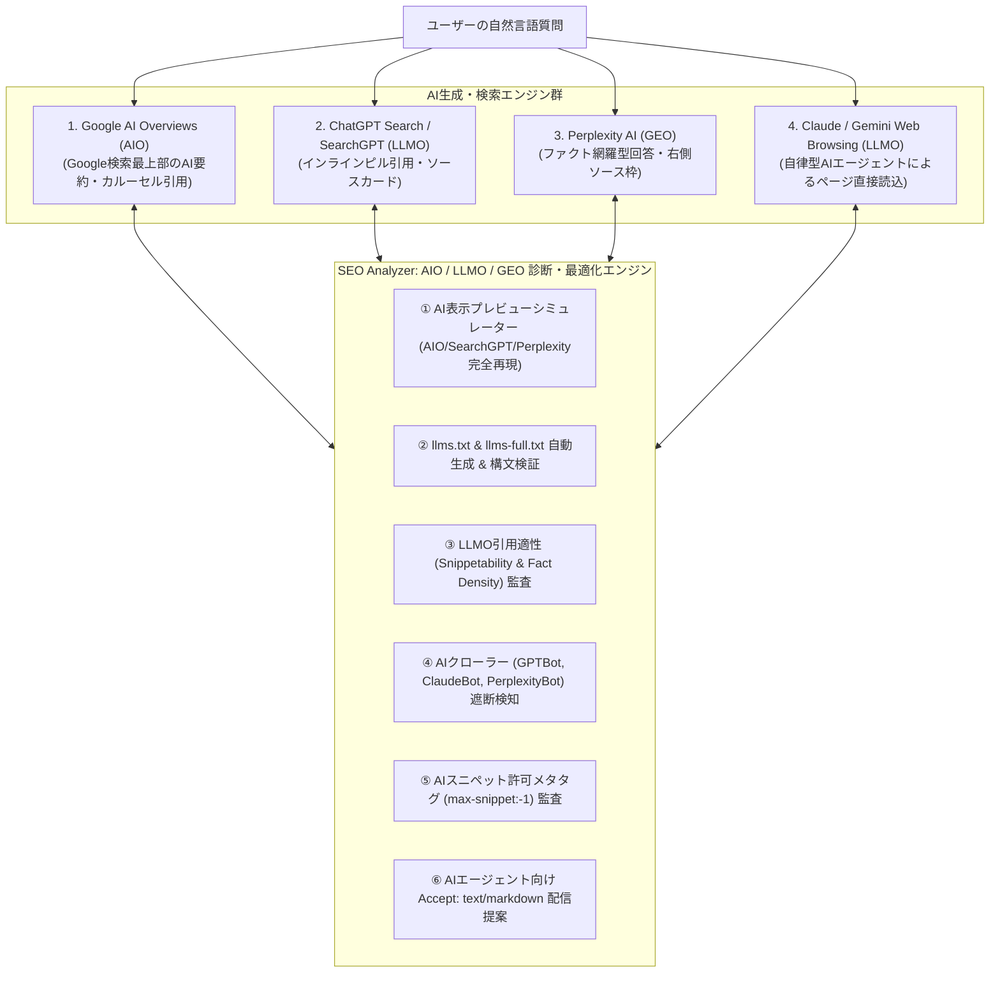

# 06. AIO / LLMO / GEO 最適化詳細設計書 (AIO & LLMO & GEO OPTIMIZATION)

> **プロジェクト名称**: SEO Analyzer  
> **ドキュメント種別**: 詳細設計書（AI Overviews Optimization: AIO / Large Language Model Optimization: LLMO / Generative Engine Optimization: GEO / llms.txt標準 / AI検索プレビューシミュレーター）  
> **版数**: 3.0.0 (AIO / LLMO / GEO 最強網羅版)

---

## 1. AIO (AI Overviews) / LLMO (LLM Optimization) / GEO (Generative Engine Optimization) とは？

従来のSEO（Search Engine Optimization）は「検索エンジンの青いリンク一覧で1位になること」を目的としていました。  
しかし現在、インターネットユーザーの情報探索は **「AIが生成した直接の回答・要約を閲覧し、引用元をたどる」** 形態へ激変しています。

本システムは、以下の3大次世代AI検索領域を完全カバーした**業界初の統合AIO/LLMO/GEO最適化エンジン**を搭載しています。



---

## 2. AIO / LLMO / GEO の6大コア機能

### 2.1 機能1: AI表示プレビューシミュレーター (AIO Simulator)
URLを入力すると、主要AIエンジンがどのようにWebページを読み取り、要約文・引用ソースカードを生成するかを画面上で完全再現します。
- **Google AI Overviews (AIO)**: 生成要約文、箇条書き要点、右側カルーセルのファビコン付きソースリンク。
- **Perplexity AI (GEO)**: ファクト密度に基づく注釈番号（`[1]`, `[2]`）と、右サイドバーのソースカード。
- **SearchGPT / ChatGPT (LLMO)**: 回答テキスト内のインラインピル型引用リンク（Pill Citations）。

### 2.2 機能2: `llms.txt` & `llms-full.txt` Web標準自動生成 & 診断
- **`llms.txt` の役割**: Anthropic、Jeremy Howard、Cloudflare等が提唱する「AI/LLMのための標準マークダウン仕様」。
- **自動生成機能**: サイト全体の構造化データ、見出し、主要ページ概要をAIが読み取りやすいクリーンなMarkdownとしてワンクリック合成。
- **配置監査**: `/llms.txt` および `/llms-full.txt` がHTTP 200で応答し、最新のドキュメントURLが含まれているかを常時死活監視。

### 2.3 機能3: LLMO引用適性（Snippetability & Fact Density）監査
LLMが回答を生成する際、Webページから「抜き出しやすい（Extractable）」構文になっているかを自然言語処理（NLP）と正規表現で判定：
1. **結論ファースト定義文 (Answerability)**: H2/H3見出しの直後に「〇〇とは、〜である」という明確な主述関係の定義文が存在するか。
2. **ファクト密度 (Fact Density)**: 500文字あたりに具体的な数値（%、円、件数、年号など）や比較表（`<table>`）が含まれているか。
3. **逆ピラミッド構造**: 重要な結論から順に書かれており、修飾語過多で要点が不明瞭になっていないか。

### 2.4 機能4: AIクローラー（Bot）アクセス制御の精密監査
`robots.txt` および HTTPレスポンスヘッダー（`X-Robots-Tag`）において、主要LLMクローラーが意図せずブロックされていないかを検証：
- `GPTBot` (OpenAI ChatGPT 学習 & 検索)
- `OAI-SearchBot` (ChatGPT Search リアルタイム検索)
- `ClaudeBot` / `anthropic-ai` (Anthropic Claude)
- `PerplexityBot` (Perplexity 検索エンジン)
- `Google-Extended` (Gemini 学習制御。検索用のGooglebotとは区別)
- `Applebot-Extended` (Apple Intelligence)

### 2.5 機能5: AIスニペット表示許可タグ (Robots Snippet Directive)
Google AI Overviews やリッチスニペットで全文抜粋と高解像度画像表示を許可するメタタグの有無を検査：
```html
<meta name="robots" content="max-snippet:-1, max-image-preview:large, max-video-preview:-1">
```
このタグが欠落している場合、Google AI Overviewsで要約文が途中で切り詰められたり、サムネイル画像が表示されずクリック率が激減します。

### 2.6 機能6: AIエージェント向け `Accept: text/markdown` 配信コード提案
自律型AIエージェントがアクセスしてきた際、重いHTML/JSではなく軽量かつ高精度なMarkdownを返すコンテントネゴシエーションコード（Next.js App Router向け）を自動生成。

---

## 3. AIO / LLMO 検査ルールマスター (`docs/02_SEO_ANALYSIS_ENGINE.md` 連携)

| ルールID | 分類 | 検査項目名 | 判定アルゴリズム | 重大度 | 配点 |
|---|---|---|---|---|---|
| `AIO-001` | AIO | **結論ファースト定義文** | H2/H3直後の1段落目（`<p>`）に「〇〇とは〜」の定義構文があるか | ⚠️ WARNING | 25点 |
| `AIO-002` | GEO | **ファクト密度 (Fact Density)** | 500文字あたりに数値、固有名詞、比較表（`<table>`）が適切に含まれているか | ⚠️ WARNING | 20点 |
| `AIO-003` | LLMO | **箇条書き・手順構造 (List)** | 3つ以上の特徴・手順が `<ul>` / `<ol>` でマークアップされているか | ℹ️ NOTICE | 15点 |
| `AIO-004` | AIO | **AIスニペット最大許可タグ** | `max-snippet:-1` および `max-image-preview:large` の設定有無 | 🚨 CRITICAL | 15点 |
| `AIO-005` | LLMO | **AIクローラーアクセス設定** | `robots.txt` で GPTBot / PerplexityBot / ClaudeBot がブロックされていないか | 🚨 CRITICAL | 15点 |
| `AIO-006` | GEO | **llms.txt Web標準の配置** | ルート直下に `/llms.txt` が存在し、構文が正しいか | ℹ️ NOTICE | 10点 |

---

## 4. AIO / LLMO / GEO スコア ($S_{\text{ai}}$) の算出式

$$
S_{\text{ai}} = \text{Answerability}(25) + \text{Fact Density}(20) + \text{List Structure}(15) + \text{Snippet Directive}(15) + \text{Bot Permission}(15) + \text{llms.txt}(10)
$$

総合ダッシュボードおよび詳細レポートにおいて、従来の「Technical SEO」「Performance (PSI)」と並列で **「AIO / LLMO レディネススコア（0〜100点）」** を独立したメトリクスとして提示します。
