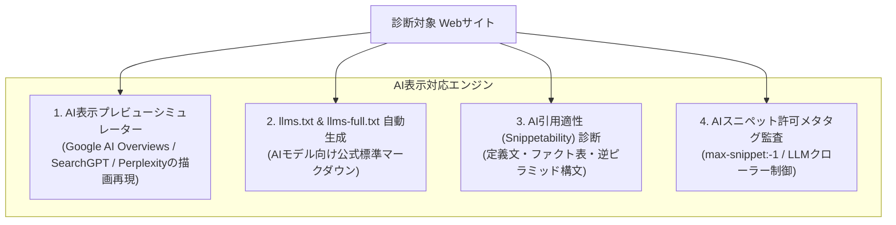

# 06. AI検索・AI表示対応・GEO最適化詳細設計書 (AI & GEO OPTIMIZATION)

> **プロジェクト名称**: SEO Analyzer  
> **ドキュメント種別**: 詳細設計書（Generative Engine Optimization: GEO / AI表示対応 / llms.txt標準 / AI検索プレビューシミュレーター）  
> **版数**: 2.0.0 (AI表示最適化 & llms.txt 拡張対応版)

---

## 1. 「SEO以外のAI表示対応」とは？

従来のSEO（Search Engine Optimization）は「検索結果の10本の青いリンクで何位になるか」を目的としていました。
しかし現在、ユーザーは以下のような**多様なAIインターフェースを通じてWebサイトの情報を閲覧・消費・推薦**されています：

1. **Google AI Overviews (SGE)**: 検索結果の最上部に巨大な要約カードとして表示され、右側に参照元サイトがカルーセル形式で掲載。
2. **ChatGPT Search / SearchGPT**: OpenAIが提供する検索エンジン。回答内にインライン引用（Pill型リンク）やリッチプレビューカードを表示。
3. **Perplexity AI**: 網羅的な回答と共に、ソースカード（Sources）として明示的にサイト名・ファビコン・引用抜粋を表示。
4. **Claude / Gemini Web Browsing**: AIアシスタントがユーザーの指示で直接Webサイトを巡回し、情報を抽出・要約してユーザーに報告。
5. **AIエージェントによる自動収集 (LLM-friendly Web)**: 外部の自律型AIエージェントがサイト情報を機械的に取得し、意思決定やタスク実行に利用。

本システムは、**「人間向けのWebページを、AIが最も正確かつ魅力的に要約・引用・推薦・表示できるように最適化する」** ための診断と修正案を提供します。

---

## 2. AI表示対応の4大主要機能



---

## 3. 機能1: AI表示プレビューシミュレーター (AI Display Simulator)

ユーザーが入力したURLを解析し、**主要AIエンジンで実際にどのように要約・引用表示されるか** を画面上で忠実に再現するシミュレーターです。

### 3.1 Google AI Overviews 風プレビュー
```
+-------------------------------------------------------------------------------+
| ✨ Google AI Overviews                                            [共有]  ... |
+-------------------------------------------------------------------------------+
| SEO Analyzerは、Webサイトの技術的SEO健全性や表示速度、およびAI検索での引用適性を |
| 瞬時にスコアリングし、Next.js等の修正コードを提示するオンライン診断ツールです。     |
| 以下の特徴があります：                                                         |
| • 100項目以上の自動監査と100点満点スコアリング                                 |
| • Google公式API（PageSpeed / Search Console）との直接連携                      |
| • ChatGPTやPerplexity向けのllms.txt自動生成                                   |
|                                                                               |
| 引用元 (Citations):                                                           |
| +-------------------------+ +-------------------------+                       |
| | [🌐] SEO Analyzer 公式   | | [🌐] NN Blog 開発者ノート |                       |
| | WebサイトのSEO・AI表示.. | | 次世代SEO診断ツールの..  |                       |
| +-------------------------+ +-------------------------+                       |
+-------------------------------------------------------------------------------+
```

### 3.2 Perplexity 風ソースカードプレビュー
```
+-------------------------------------------------------------------------------+
| 🔍 Perplexity Answer                                              15 sources  |
+-------------------------------------------------------------------------------+
| SEO Analyzerに関する詳細：                                                    |
| 現代のSEOにおいて重要なCore Web Vitalsや構造化データに加え、Google AI         |
| Overviewsに引用されるための「定義文構造」や「ファクト密度」を自動監査できます [1]。 |
|                                                                               |
| [1] seo-analyzer.example.com - 次世代SEO & AI表示診断プラットフォーム           |
+-------------------------------------------------------------------------------+
```

---

## 4. 機能2: `llms.txt` / `llms-full.txt` Web標準対応

### 4.1 `llms.txt` とは？
`llms.txt` は、Jeremy Howard（Answer.AI）らによって提唱され、Anthropic、Cloudflare、Vercelなどが採用を進めている**「AI/LLMのためのWeb標準マークダウン仕様」**です。
人間向けの重厚なHTML/CSS/JavaScriptではなく、**AIが最も理解しやすいクリーンなMarkdown形式** でサイト概要やドキュメント構造を `/llms.txt` に配置します。

### 4.2 本システムの診断 & 自動生成仕様
本システムは対象サイトをクロールし、ルート直下に配置できる `/llms.txt` をワンクリックで自動生成します。

#### 自動生成される `/llms.txt` の例
```markdown
# SEO Analyzer

> WebサイトのSEO健全度・Core Web Vitals・AI検索（GEO）表示適性を自動診断するエンジニア向けSaaSプラットフォーム。

## 主な機能
- [即時On-Page診断](https://example.com/docs/quick-audit): URLを入力するだけで100項目以上を数秒で監査。
- [Google公式API連携](https://example.com/docs/google-api): PageSpeed InsightsおよびSearch Consoleの実測データ統合。
- [AI表示対応](https://example.com/docs/ai-display): Google AI OverviewsやPerplexity向けの最適化。
- [llms.txtジェネレーター](https://example.com/docs/llms-generator): 自社サイト用llms.txtのワンクリック生成。

## コアAPIエンドポイント
- `POST /api/v1/audit/quick`: 単一URL即時診断
- `GET /api/v1/audit/stream/:jobId`: SSEリアルタイム進捗ストリーム
```

---

## 5. 機能3: AI引用適性（Snippetability & Fact Density）診断

AIエンジンがWebページから文章を「切り取って（Quote / Snippet）」回答に組み込むための構文要件を検査します。

### 5.1 診断チェック項目

| ルールID | 項目名 | 判定基準 | 減点/加点 |
|---|---|---|---|
| `AI-001` | **結論ファースト定義文 (Answerability)** | 主要見出し（H2/H3）直後の最初の段落に、「〇〇とは、〜である」という明確な主述関係の定義文があるか | ⚠️ -15点 |
| `AI-002` | **ファクト密度 (Fact Density)** | 500文字あたりに数値（%、円、年号等）や固有名詞、比較表（`<table>`）が適切な比率で含まれているか | ⚠️ -10点 |
| `AI-003` | **箇条書き・手順構造 (Listification)** | 3つ以上の手順や特徴を述べる際に、平文ではなく `<ul>` または `<ol>` でマークアップされているか | ℹ️ -5点 |
| `AI-004` | **AIスニペット表示許可タグ** | `<meta name="robots" content="max-snippet:-1, max-image-preview:large, max-video-preview:-1">` が設定されているか（ないとAI要約で省略される） | 🚨 -20点 |
| `AI-005` | **AIクローラーアクセス設定** | `robots.txt` で `GPTBot`, `ClaudeBot`, `PerplexityBot` が遮断されていないか | 🚨 -25点 |

---

## 6. 機能4: AI表示のための具体的修正案（Code & Text Snippets）

### 6.1 修正案例1: AIスニペット最大表示メタタグの付与
Google AI Overviews や Google Discover で記事カードが最大サイズで表示されるための必須タグです。

```html
<!-- 🔴 Before: 設定なし（Googleが要約抜粋や高解像度サムネイルを制限する可能性あり） -->

<!-- 🟢 After: Next.js App Router (app/layout.tsx または page.tsx) での設定コード -->
export const metadata: Metadata = {
  robots: {
    index: true,
    follow: true,
    googleBot: {
      index: true,
      follow: true,
      'max-video-preview': -1,
      'max-image-preview': 'large',
      'max-snippet': -1,
    },
  },
};
```

---

### 6.2 修正案例2: AI向けクリーンMarkdown配信 (`Accept: text/markdown`)
次世代のWeb標準として、AIエージェントがリクエストヘッダーに `Accept: text/markdown` を付与してアクセスしてきた際に、HTMLではなく軽量なMarkdownを返すNext.js Route Handlerコードを提案します。

```typescript
// app/api/article/[slug]/route.ts (または middleware.ts)
import { NextRequest, NextResponse } from 'next/server';

export async function GET(request: NextRequest) {
  const acceptHeader = request.headers.get('accept') || '';

  // AIエージェント（PerplexityBot, ChatGPT等）がMarkdownを要求した場合
  if (acceptHeader.includes('text/markdown')) {
    const markdownContent = `
# SEO Analyzer 概要
SEO AnalyzerはWebサイトの健全度を自動診断するツールです。

## 主な仕様
- 計測速度: 3秒以内
- 検査項目: 100項目以上
- 料金: 無料から
    `.trim();

    return new NextResponse(markdownContent, {
      headers: {
        'Content-Type': 'text/markdown; charset=utf-8',
        'Vary': 'Accept',
      },
    });
  }

  // 通常のブラウザにはHTMLを返却
  return NextResponse.next();
}
```

---

## 7. AI表示総合スコア ($S_{\text{ai}}$) の算出式

$$
S_{\text{ai}} = \text{Answerability}(25) + \text{Fact Density}(25) + \text{llms.txt対応}(20) + \text{AIクローラー許可}(15) + \text{スニペットメタタグ}(15)
$$

総合診断レポートにおいて、従来のSEOスコアと並列して「**AI表示最適化スコア（0〜100点）**」を独立カードとして表示し、Web担当者がこれからのAI時代に備えられるようにします。
