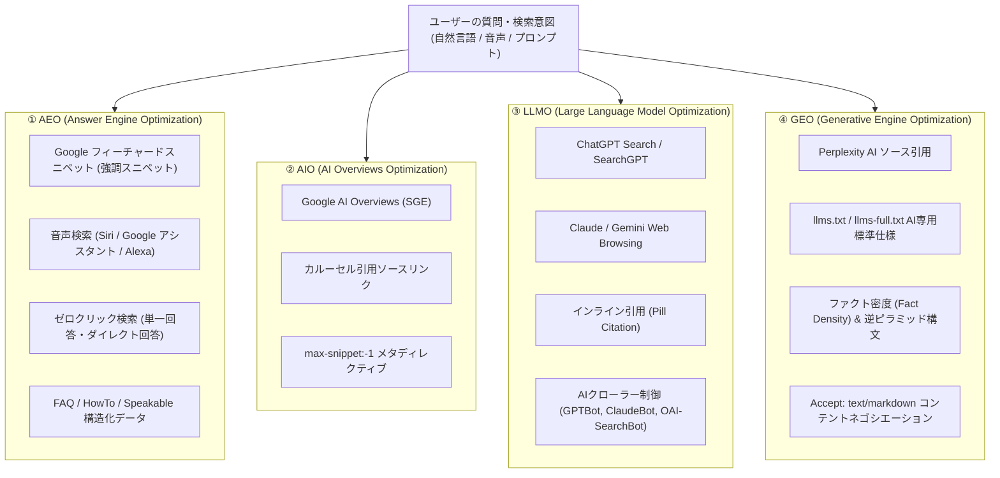

# 06. AEO / AIO / LLMO / GEO 最適化詳細設計書 (AEO & AIO & LLMO & GEO)

> **プロジェクト名称**: SEO Analyzer  
> **ドキュメント種別**: 詳細設計書（Answer Engine Optimization: AEO / AI Overviews: AIO / Large Language Model Optimization: LLMO / Generative Engine Optimization: GEO / 音声検索・ダイレクトアンサー・llms.txt）  
> **版数**: 4.0.0 (AEO / AIO / LLMO / GEO 完全統合版)

---

## 1. AEO / AIO / LLMO / GEO の違いと包括的定義

次世代の検索・AI応答最適化は、以下の4つのレイヤーで構成されており、本システムはその**すべて（AEO / AIO / LLMO / GEO）** を診断・改善案提示の対象としています。



| 略称 | 正式名称 | 主な対象エンジン | 最適化のゴール |
|---|---|---|---|
| **AEO** | **Answer Engine Optimization** | Google強調スニペット、Siri、Alexa、Googleアシスタント | 質問に対して「唯一の直接回答」として選ばれ、音声読み上げや強調枠を獲得する |
| **AIO** | **AI Overviews Optimization** | Google AI Overviews (旧SGE) | 検索結果トップのAI要約内に引用され、右側カルーセルリンクに掲載される |
| **LLMO** | **LLM Optimization** | ChatGPT Search, SearchGPT, Claude, Gemini | LLMの事前学習・リアルタイム検索において言及・インライン引用される |
| **GEO** | **Generative Engine Optimization** | Perplexity AI, 各種生成AI検索全般 | AI生成テキスト内の注釈ソースとして高頻度で引用・参照される |

---

## 2. AEO (Answer Engine Optimization) 特化診断エンジン仕様

AEOは、AIや検索エンジンがユーザーの「〜とは？」「〜の手順は？」「どちらが良い？」という**疑問に対してダイレクトに回答を抽出できるか**を検査します。

### 2.1 AEO-001: Speakable 構造化データ & 音声検索適性 (`schema.org/speakable`)
スマートスピーカー（Google Home、Siri、Alexa）がWebページの一部を読み上げるための `speakable` 仕様を検査。
```json
{
  "@context": "https://schema.org",
  "@type": "Article",
  "name": "SEO Analyzerの機能と特徴",
  "speakable": {
    "@type": "SpeakableSpecification",
    "cssSelector": [".headline", ".summary"]
  }
}
```

### 2.2 AEO-002: FAQPage / QAPage リッチアンサー構造
「質問」と「回答」が明確にペアになっているかを検証し、Googleのダイレクト回答枠やPerplexityのQ&A抽出を最大化。
- `FAQPage` 構造化データが正しいJSON-LDで記述されているか。
- 回答文が30〜50語（日本語で80〜120文字）の簡潔なダイレクトアンサーになっているか。

### 2.3 AEO-003: HowTo / 手順スニペット構造
ハウツー記事や操作ガイドにおいて、`<ol>` や `HowTo` 構造化データを用いてステップバイステップ形式でマークアップされているか。

### 2.4 AEO-004: 40〜60語の「スニペットターゲット段落」
Google強調スニペットおよびAIアンサーエンジンが最も好む文字数（日本語で100〜160文字）で、見出し直下に明快な回答が置かれているか。

---

## 3. AIO / LLMO / GEO 特化機能仕様

### 3.1 機能1: AIマルチエンジン表示シミュレーター (`/audit/:id/ai-preview`)
単一の診断で以下の4つのUIプレビューを並列シミュレーション：
1. **Google AI Overviews (AIO)**: 要約文 + カルーセル引用カード
2. **Google 強調スニペット & 音声読み上げ (AEO)**: ダイレクトアンサー枠 + 音声プレビュー
3. **ChatGPT Search (LLMO)**: インライン引用ピル + 参照ソース
4. **Perplexity AI (GEO)**: ファクト網羅型回答 + 番号付き注釈カード

### 3.2 機能2: `llms.txt` & `llms-full.txt` Web標準自動生成
- サイト内のドキュメント、主要エンドポイント、製品情報をAIモデル向けMarkdownとして合成。
- `/llms.txt` の配置状態・HTTPステータス・リンク切れを常時監査。

### 3.3 機能3: AIクローラー（Bot）アクセス権限監査
`robots.txt` で以下の全クローラーのAllow/Disallowを検査：
- `GPTBot` (ChatGPT)
- `OAI-SearchBot` (SearchGPT)
- `ClaudeBot` / `anthropic-ai` (Claude)
- `PerplexityBot` (Perplexity)
- `Google-Extended` (Gemini 学習制御)
- `Applebot-Extended` (Apple Intelligence)

### 3.4 機能4: AIスニペット最大許可タグ (`max-snippet:-1`)
```html
<meta name="robots" content="max-snippet:-1, max-image-preview:large, max-video-preview:-1">
```

### 3.5 機能5: `Accept: text/markdown` コンテントネゴシエーション
AIエージェントからのアクセスに対して、HTMLをパースさせずに超高速かつトークン効率の高いMarkdownを直接返すNext.js実装コードを提案。

---

## 4. AEO / AIO / LLMO / GEO 全検査ルール一覧

| ルールID | レイヤー | 検査項目名 | 判定アルゴリズム | 重大度 |
|---|---|---|---|---|
| `AEO-001` | **AEO** | **ダイレクトアンサー定義文** | H2/H3直後の第1段落が100〜160文字の簡潔な結論になっているか | ⚠️ WARNING (-15) |
| `AEO-002` | **AEO** | **FAQPage / Speakable構造化**| `FAQPage` または `speakable` スキーマが正しく実装されているか | ⚠️ WARNING (-15) |
| `AEO-003` | **AEO** | **HowTo / ステップマークアップ**| 手順説明が `<ol>` / `HowTo` 構造で機械可読になっているか | ℹ️ NOTICE (-10) |
| `AIO-001` | **AIO** | **スニペット最大許可メタタグ** | `max-snippet:-1` / `max-image-preview:large` の設定有無 | 🚨 CRITICAL (-20) |
| `LLMO-001`| **LLMO** | **AIクローラーアクセス設定** | `robots.txt` で GPTBot / PerplexityBot / ClaudeBot が開口しているか | 🚨 CRITICAL (-25) |
| `LLMO-002`| **LLMO** | **箇条書き・表構造マークアップ**| 3点以上の並列要素が `<ul>` または `<table>` でマークアップされているか | ℹ️ NOTICE (-10) |
| `GEO-001` | **GEO** | **ファクト密度 (Fact Density)** | 500文字あたりに数値、固有名詞、統計データが十分含まれているか | ⚠️ WARNING (-15) |
| `GEO-002` | **GEO** | **llms.txt Web標準の配置** | ルート直下に構文正しい `/llms.txt` が配置されているか | ℹ️ NOTICE (-10) |

---

## 5. 総合次世代AIレディネススコア ($S_{\text{ai-ready}}$)

$$
S_{\text{ai-ready}} = \text{AEO}(30) + \text{AIO}(25) + \text{LLMO}(25) + \text{GEO}(20)
$$

ダッシュボードおよびPDFレポートにおいて、従来のSEOスコアと並び **「AEO / AIO / LLMO / GEO 次世代AI対応スコア（0〜100点）」** を提示します。
