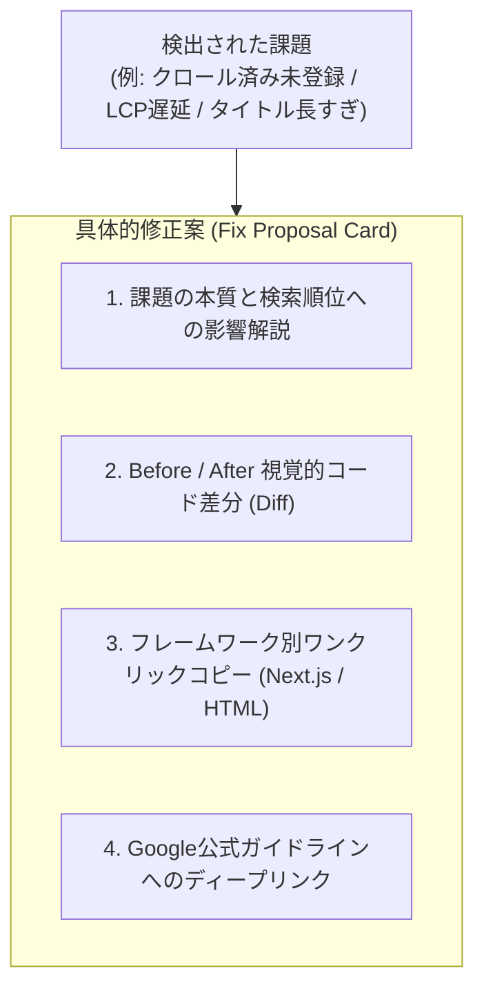

# 07. Google公式API連携 & 具体的修正案生成エンジン仕様書 (GOOGLE OFFICIAL APIS & FIX PROPOSALS)

> **プロジェクト名称**: SEO Analyzer  
> **ドキュメント種別**: 詳細設計書（Google公式API群連携仕様・認証方式・データマッピング・修正案生成ロジック）  
> **版数**: 1.0.0

---

## 1. 連携するGoogle公式APIの概要

本プラットフォームは、Googleが公式に提供するWebマスター・開発者向けAPI群を統合し、サードパーティ製ツールの推測値ではなく**「Google公式の生データに基づく高精度な診断と、確実な修正案」**を提供します。

```mermaid
graph TD
    App["SEO Analyzer サーバー"]
    
    subgraph GoogleAPIs["Google 公式API群"]
        PSI["1. PageSpeed Insights API v5\n(Lighthouse & CrUX 実ユーザー体験)"]
        GSC_Inspect["2. Search Console URL Inspection API\n(Google公式インデックス状態・リッチリザルト)"]
        GSC_Search["3. Search Console Search Analytics API\n(クエリ・表示回数・順位・CTR分析)"]
        SafeBrowse["4. Google Safe Browsing API v4\n(セキュリティ・マルウェア・フィッシング判定)"]
        Indexing["5. Google Indexing API v3\n(新規/更新URLの即時クロール通知)"]
        Gemini["6. Google Gemini API\n(文脈認識による修正案・日本語リライト自動生成)"]
    end

    App -->|API Key| PSI
    App -->|OAuth2 / Service Account| GSC_Inspect
    App -->|OAuth2 / Service Account| GSC_Search
    App -->|API Key| SafeBrowse
    App -->|Service Account (JWT)| Indexing
    App -->|API Key / Vertex AI| Gemini
```

---

## 2. 各Google公式APIの詳細仕様

### 2.1 Google PageSpeed Insights API (PSI v5)
Googleの公式Lighthouseエンジンおよび実ユーザー体験データ（Chrome UX Report: CrUX）を同時に取得します。

- **エンドポイント**: `GET https://pagespeedonline.googleapis.com/pagespeedonline/v5/runPagespeed`
- **認証**: Google Cloud API Key
- **パラメータ**:
  - `url`: 診断対象URL
  - `strategy`: `mobile` または `desktop`
  - `category`: `performance`, `accessibility`, `best-practices`, `seo`
- **取得メトリクス**:
  - **CrUX 実測値**: `LARGEST_CONTENTFUL_PAINT_MS`, `INTERACTION_TO_NEXT_PAINT`, `CUMULATIVE_LAYOUT_SHIFT_SCORE`, `FIRST_INPUT_DELAY_MS`
  - **Lighthouse 診断項目 (Opportunities)**:
    - `unused-css-rules` (未使用CSSの削除と削減可能バイト数)
    - `unused-javascript` (未使用JSの削減可能バイト数)
    - `modern-image-formats` (WebP / AVIFへの変換推奨)
    - `render-blocking-resources` (レンダリングをブロックするリソースの特定)
    - `server-response-time` (TTFB)

---

### 2.2 Google Search Console URL Inspection API
Googlebotが実際にどのようにページをインデックスしているか、公式の最新ステータスを取得します。

- **エンドポイント**: `POST https://searchconsole.googleapis.com/v1/urlInspection/index:inspect`
- **認証**: OAuth 2.0 (ユーザー所有サイト) または サービスアカウント（委託サイト）
- **スコープ**: `https://www.googleapis.com/auth/webmasters.readonly`
- **主要レスポンス項目**:
  - `inspectionResult.indexStatusResult.coverageState`:
    - `Submitted and indexed` (インデックス登録済み - 正常)
    - `Crawled - currently not indexed` (クロール済みインデックス未登録 - コンテンツ品質/優先度不足)
    - `Discovered - currently not indexed` (検出済みインデックス未登録 - クロールバジェット不足/リンク網羅不足)
    - `Duplicate without user-selected canonical` (canonical不備による重複判定)
  - `inspectionResult.indexStatusResult.verdict`: `PASS` / `NEUTRAL` / `FAIL`
  - `inspectionResult.indexStatusResult.robotsTxtState`: `ALLOWED` / `DISALLOWED`
  - `inspectionResult.indexStatusResult.indexingState`: `INDEXING_ALLOWED` / `BLOCKED_BY_META_TAG`
  - `inspectionResult.richResultsResult`: 検出された構造化データ（Product, Article, FAQ等）の検証エラーと警告

---

### 2.3 Google Search Console Search Analytics API
実際に検索結果で流入しているクエリや、クリック率（CTR）が低迷している「お宝キーワード」を発掘します。

- **エンドポイント**: `POST https://searchconsole.googleapis.com/webmasters/v3/sites/{siteUrl}/searchAnalytics/query`
- **分析ロジック**:
  - **低CTR課題（Low CTR Opportunity）**: 検索順位が1〜5位であるにもかかわらず、CTRが平均を大きく下回っているクエリを抽出（タイトルタグやメタディスクリプションの訴求力不足を特定）。
  - **ストライクゾーン課題（Quick Win）**: 検索順位が11〜20位（2ページ目）のクエリを抽出（見出し追加や本文補強で1ページ目進出が狙えるキーワード）。

---

### 2.4 Google Safe Browsing API (v4)
Googleが管理する悪意のあるURLブラックリストに抵触していないかを検査します。抵触した場合、検索順位の急落やブラウザでの赤画面警告が発生します。

- **エンドポイント**: `POST https://safebrowsing.googleapis.com/v4/threatMatches:find`
- **脅威タイプ**:
  - `MALWARE` (マルウェア配信)
  - `SOCIAL_ENGINEERING` (フィッシング・なりすまし)
  - `UNWANTED_SOFTWARE` (不要なソフトウェア)
  - `POTENTIALLY_HARMFUL_APPLICATION` (有害アプリ)

---

### 2.5 Google Indexing API (v3)
新規記事の公開時、または緊急でメタタグ・404修正を反映させたい際に、Googlebotへ優先クロール通知を送信します。

- **エンドポイント**: `POST https://indexing.googleapis.com/v3/urlNotifications:publish`
- **認証**: Service Account (JWT)
- **スコープ**: `https://www.googleapis.com/auth/indexing`
- **リクエスト**:
  ```json
  {
    "url": "https://example.com/updated-page",
    "type": "URL_UPDATED"
  }
  ```

---

### 2.6 Google Gemini API (修正案自動生成エンジン)
Googleの最新LLM（Gemini 2.0 Flash / Pro）を活用し、検出された課題を解決するための**「自然で検索意図に沿った日本語修正テキスト」**および**「Next.js等の実装コード」**をオンデマンドで生成します。

- **役割**:
  1. タイトルタグの全角30文字リライト（キーワードを含みクリック率を高める文案を3パターン提示）
  2. メタディスクリプションの要約生成（全角100文字前後の魅力的なリード文）
  3. GEO向け結論ファースト定義文の自動生成（H2見出し直下に挿入するアンサーブロック）
  4. ページ内容に応じたSchema.org JSON-LDコードの即時合成

---

## 3. 具体的修正案（Fix Proposal）表示エンジンの設計

各診断項目に対し、ユーザーが迷わず即座に修正を実行できるよう、以下の**4重レイヤー構造**で修正案をUIに表示します。



---

## 4. 課題別・具体的修正案のテンプレート仕様

### 4.1 【GSC連携課題】「クロール済み - インデックス未登録」の場合
- **診断原因**: Googlebotはページを巡回したが、「コンテンツの独自性が低い」「内部リンクからの到達性が悪い」「文字数が少なくペラペラである」と判断してインデックスを見送った状態。
- **UI表示される修正案**:
  ```markdown
  #### 🛠️ 推奨アクション: コンテンツ独自性の補強と内部リンク強化
  1. **内部リンクの追加**: トップページまたは親カテゴリ一覧から、本ページへのアンカーテキスト付きリンクを設置してください。
  2. **独自一次情報の追記**: 他サイトの引用だけでなく、自社の事例・数値データ・具体的な手順を最低800文字追加してください。
  3. **Googlebot優先巡回通知**: 修正後、画面下の「Google Indexing APIで巡回リクエストを送信」ボタンをクリックしてください。
  ```

---

### 4.2 【PSI連携課題】「レンダリングを妨げるリソースの除外 / 未使用JSの削減」の場合
- **診断原因**: Headタグ内で巨大な外部スクリプトが同期読み込みされ、FCPおよびLCPが大幅に悪化している。
- **Before / After 差分表示**:

```html
<!-- 🔴 Before (検出された問題コード: 描画をブロックする外部スクリプト) -->
<head>
  <script src="https://cdn.example.com/analytics.js"></script>
</head>

<!-- 🟢 After (改善案: defer / async または Next.js Script 最適化) -->
<!-- 生HTMLの場合: -->
<head>
  <script src="https://cdn.example.com/analytics.js" defer fetchpriority="low"></script>
</head>

<!-- Next.js (App Router) の場合: -->
import Script from 'next/script';

export default function RootLayout({ children }) {
  return (
    <html lang="ja">
      <body>
        {children}
        <Script
          src="https://cdn.example.com/analytics.js"
          strategy="lazyOnload"
        />
      </body>
    </html>
  );
}
```

---

### 4.3 【GSC Search Analytics連携課題】「掲載順位 3位 なのに CTR 1.8%（業界平均 8.5%）」の場合
- **診断原因**: 検索結果の上位に表示されているにもかかわらず、タイトルタグが抽象的で競合にクリックを奪われている。
- **Geminiが自動生成する3つの改善タイトル案**:
  ```text
  案1 (具体性重視): 【2026年最新】SEO評価サイト徹底比較｜失敗しない選び方5選
  案2 (ベネフィット重視): WebサイトのSEOスコアを3秒で無料診断！改善コードも即提示
  案3 (権威性重視): プロが教えるSEO技術監査ガイド｜Google公式APIによる高精度測定
  ```

---

### 4.4 【安全対策課題】「Safe Browsing 警告 / セキュリティヘッダー欠落」の場合
- **修正案**: `next.config.mjs` に安全ヘッダーを追加する完全な設定スニペットを提示。

```javascript
// next.config.mjs
/** @type {import('next').NextConfig} */
const nextConfig = {
  async headers() {
    return [
      {
        source: '/(.*)',
        headers: [
          { key: 'X-Content-Type-Options', value: 'nosniff' },
          { key: 'X-Frame-Options', value: 'DENY' },
          { key: 'Referrer-Policy', value: 'strict-origin-when-cross-origin' },
          { key: 'Permissions-Policy', value: 'camera=(), microphone=(), geolocation=()' },
          { key: 'Strict-Transport-Security', value: 'max-age=63072000; includeSubDomains; preload' },
        ],
      },
    ];
  },
};

export default nextConfig;
```
