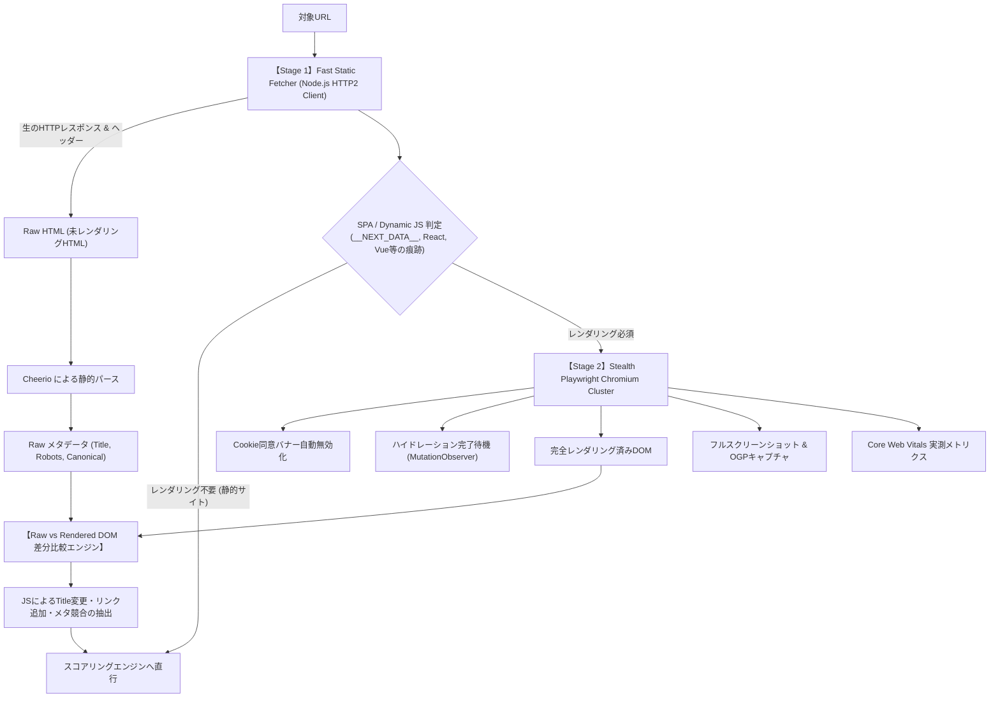
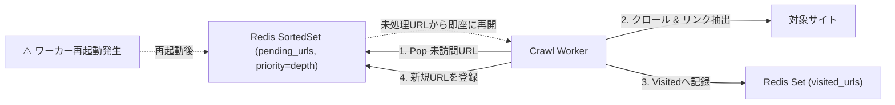

# 10. クローラー・Bot対策回避・SPA描画判定 完全技術仕様書 (CRAWLER & SCRAPING ENGINE)

> **プロジェクト名称**: SEO Analyzer  
> **ドキュメント種別**: 詳細技術仕様書（WAF/Bot対策回避・SPA完全描画判定・Raw vs Rendered DOM比較・クローラー礼儀・チェックポイント再開）  
> **版数**: 1.0.0

---

## 1. クローラーエンジンのコア課題と解決策

商用WebサイトのSEO診断およびクロールにおいて、一般的なナイーブなクローラー（単純なHTTP GETや標準Playwright）は以下の問題に直面し、誤判定やブロックを引き起こします：

| 現場で発生する問題 | 従来のクローラーの失敗 | 本システムの高精度ソリューション |
|---|---|---|
| **WAF / Bot対策による403/503遮断** | Cloudflare / Akamai / Datadome にBotと判定され診断不能 | **Stealth Chromium構成 + 正当な独自Bot識別ヘッダー + 段階的フォールバック** |
| **SPAの非同期描画待ち不備** | `networkidle` のタイムアウトや未描画状態での早期パース | **React/Next.js ハイドレーション完了マーカー検知 + DOM Mutation Observer** |
| **Cookie同意バナーによる視覚遮蔽** | OneTrust / Cookiebot 等が画面を覆いLCP・A11y誤判定 | **CMPバナー自動検出 & CSS/DOMによる透過・無効化レイヤー** |
| **Raw HTML vs Rendered DOM の乖離** | JS実行前後のTitleやcanonicalの食い違いを見逃す | **静的HTMLと動的DOMの二重抽出 & 差分比較エンジン (Dual-Stage Diff)** |
| **無限ループ・クロールトラップ** | カレンダーやファセット絞り込みで数万URLを無限巡回 | **URL正規化（Canonicalization）+ パラメータ除外 + 最大深度3制限** |
| **大規模クロール時のワーカークラッシュ** | メモリ枯渇で途中で止まり最初からやり直し | **Redis永続化によるチェックポイント方式 (Resumable Crawl)** |

---

## 2. 2段階解析パイプライン (Dual-Stage Pipeline)

Googlebotが「フェーズ1: 静的HTMLクロール」と「フェーズ2: レンダリングキュー（WRS: Web Rendering Service）」の2段階で処理するのと同様に、本システムも完全な2段階アーキテクチャを実装します。



---

## 3. SPAハイドレーション完了判定アルゴリズム (Hydration Detection)

`networkidle0` や固定秒数待機（`setTimeout`）に依存せず、フレームワーク固有のシグナルとDOMの変化停止を検知して最速・正確にレンダリング完了を判定します。

```typescript
// crawler/src/hydration-waiter.ts
import { Page } from 'playwright';

export async function waitForDomHydration(page: Page, timeoutMs = 8000): Promise<void> {
  await Promise.race([
    page.evaluate(() => {
      return new Promise<void>((resolve) => {
        // 1. Next.js / React のハイドレーション完了判定
        const isNextReady = () => {
          const nextData = (window as any).__NEXT_DATA__;
          if (nextData) {
            // Next.js App Router / Pages Router のルートコンテナ
            const appRoot = document.querySelector('#__next') || document.querySelector('body > main');
            if (appRoot && appRoot.children.length > 0) return true;
          }
          return false;
        };

        if (isNextReady()) return resolve();

        // 2. DOM Mutation Observer による静穏状態の検知 (500ms間DOM変更がなければ完了とみなす)
        let lastMutationTime = Date.now();
        const observer = new MutationObserver(() => {
          lastMutationTime = Date.now();
        });

        observer.observe(document.body, {
          childList: true,
          subtree: true,
          attributes: true,
        });

        const checkInterval = setInterval(() => {
          if (Date.now() - lastMutationTime > 500) {
            clearInterval(checkInterval);
            observer.disconnect();
            resolve();
          }
        }, 100);
      });
    }),
    new Promise((_, reject) => setTimeout(() => resolve(), timeoutMs)), // フォールバックタイムアウト
  ]);
}
```

---

## 4. Cookie同意バナー (CMP) 自動無効化仕様

LCP計測やフルページスクリーンショットにおいて、画面最下部や中央を覆うCookieバナーを自動的に非表示化します。

```typescript
// crawler/src/cmp-bypass.ts
export const CMP_SELECTORS = [
  '#onetrust-consent-sdk',
  '#CybotCookiebotDialog',
  '.cookie-banner',
  '.cc-banner',
  '#cookie-notice',
  'div[id*="cookie"]',
  'div[class*="consent"]',
];

export async function dismissCookieBanner(page: Page): Promise<void> {
  await page.evaluate((selectors) => {
    selectors.forEach((selector) => {
      const el = document.querySelector(selector);
      if (el) {
        (el as HTMLElement).style.display = 'none';
        (el as HTMLElement).style.visibility = 'hidden';
      }
    });
    // bodyのスクロールロックを解除
    document.body.style.overflow = 'auto';
  }, CMP_SELECTORS);
}
```

---

## 5. Raw HTML vs Rendered DOM 差分検知 (JS SEO Diff)

GooglebotはJavaScriptを実行しますが、**「HTML取得直後の状態」と「JS実行後の状態」でTitleやCanonicalが異なると、インデックス遅延や誤ったスニペット生成の原因**になります。

### 差分検知ルールマスター
| 差分検知項目 | 危険度 | 現象と影響 |
|---|---|---|
| **Titleの書き換え** | ⚠️ WARNING | Raw HTMLはデフォルトタイトル（例: "React App"）、JS実行後に本番タイトルになる（クローラーが未実行時にゴミタイトルをインデックス） |
| **Canonicalの後付け** | 🚨 CRITICAL | Raw HTMLにCanonicalがなく、JSで後から挿入される（Googlebotが初期パース時に正規化をスキップ） |
| **Noindexの動的削除/追加** | 🚨 CRITICAL | Raw HTMLに `noindex` がありJSで消している（GoogleはHTML段階で即座にインデックス除外決定するリスク大） |
| **内部リンクの100% JS生成** | ⚠️ WARNING | Raw HTMLに `<a>` タグが1つもなく全てJSのclickイベント（Googlebotがクロールリンクを発見できない） |

---

## 6. クロール中断・チェックポイント再開設計 (Resumable Crawling)

1万ページ規模のディープクロール中にワーカーが再起動しても、進捗を失わずに再開できるアーキテクチャです。



- **Redisデータ構造**:
  - `crawl:{sessionId}:visited`: 訪問済みURLのハッシュセット（重複巡回完全防止）
  - `crawl:{sessionId}:pending`: スコア付き未訪問URLキュー（浅い階層から優先的に処理）
  - `crawl:{sessionId}:stats`: 処理済み件数、404エラー数、消費バイト数のアトミックインクリメント
