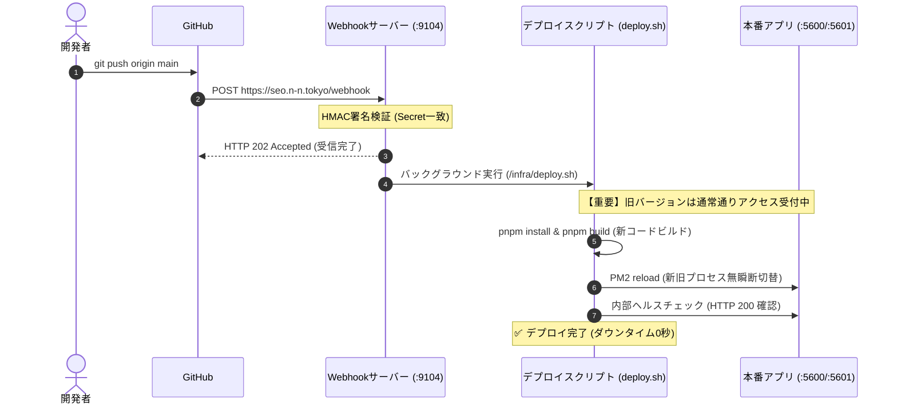

# GitHub Webhook 自動デプロイ設定マニュアル (人間向け手順書)

> **対象者**: 開発担当者、インフラ運用者、プロジェクト管理者  
> **対象リポジトリ**: `git@nntokyo:nntokyo/seo.n-n.tokyo.git`  
> **本番URL**: `https://seo.n-n.tokyo`  
> **更新日**: 2026年9月13日

---

## 📌 概要

本システム（SEO Analyzer）は、GitHubの `main` ブランチにコードがプッシュされた際、**GitHub Webhook** が本番サーバーへ即時通知を送り、**ゼロダウンタイム（無瞬断・サービス停止ゼロ）** で自動的に最新版へ更新されるよう構成されています。

このドキュメントでは、GitHubの管理画面で Webhook を設定する手順をわかりやすく解説します。

---

## 🛠️ GitHub Webhook の設定手順

### ステップ 1: GitHubのリポジトリ設定ページを開く
1. ブラウザで GitHub の該当リポジトリページ（`nntokyo/seo.n-n.tokyo`）を開きます。
2. 上部メニュー右端の **「⚙️ Settings」** タブをクリックします。
3. 左サイドバーの「Code and automation」内にある **「Webhooks」** をクリックします。
4. 画面右上の **「Add webhook」** ボタンをクリックします。

---

### ステップ 2: Webhook のパラメータを入力する

表示された入力フォームに、以下の通り正確に入力してください。

| 項目名 | 設定値 | 説明・注意事項 |
|---|---|---|
| **Payload URL** | `https://seo.n-n.tokyo/webhook` | 本番サーバー（Caddy）が受信し、ポート9104のWebhookサーバーへ中継します。 |
| **Content type** | `application/json` | **必ず `application/json` を選択**してください（`x-www-form-urlencoded` だと署名検証に失敗します）。 |
| **Secret** | `f9f7a5394be10808383112991bed9f6552b3a06c0467af55` | サーバー上の `.env` (`DEPLOY_WEBHOOK_SECRET`) と完全に一致する認証キーです。HMAC-SHA256署名の照合に使用されます。 |
| **SSL verification** | `Enable SSL verification` | 有効のままでOKです（Let's Encrypt 有効な証明書を使用しています）。 |
| **Which events would you like to trigger this webhook?** | `Just the push event` | **「Just the push event」**（デフォルト）を選択してください。 |
| **Active** | `☑ Active` | チェックが入っている（有効）ことを確認します。 |

---

### ステップ 3: 設定を保存して動作確認する
1. ページ下部の緑色のボタン **「Add webhook」** をクリックして保存します。
2. 保存直後、GitHubが自動的にテスト信号（`ping` イベント）を送信します。
3. 登録されたWebhook一覧に緑色のチェックマーク（`✔`）と **「HTTP 200」** が表示されていれば設定完了です！

---

## 🔒 セキュリティと自動デプロイの仕組み

### 1. なぜ安全なのか？ (HMAC-SHA256 署名検証)
- 第三者が勝手に `https://seo.n-n.tokyo/webhook` を叩いても、**Secretキーを知らないリクエストはすべて `401 Unauthorized` で即座に破棄**されます。
- GitHubがリクエストヘッダー `X-Hub-Signature-256` に付与したハッシュ値をサーバー側でミリ秒単位で照合します。

### 2. どうやって無瞬断（ダウンタイム0秒）で更新されるのか？


1. **稼働中バックグラウンドビルド (No Pre-kill)**:
   ビルドが完全に成功するまで、既存のプロセス（Webサイト）は停止しません。
2. **PM2 Graceful Reload**:
   新プロセスが起動して通信可能になった瞬間にリクエストを切り替えるため、502エラーや画面の読み込みエラーが発生しません。
3. **自動ロールバック保護**:
   万が一、新しいコードにビルドエラーや起動不具合があった場合、**自動的に直前の正常コミットへ即時ロールバック**され、旧バージョンがそのまま動き続けます。

---

## 🚨 トラブルシューティング

### Q1. GitHub側で赤色のバツ（`✖`）が表示され、`401 Invalid HMAC signature` になる
- **原因**: 入力した Secret が、本番サーバーの `.env` と一致していません。
- **対処法**: GitHubのWebhook編集画面で、Secretに上記表の値を再入力して更新してください。

### Q2. GitHub側で `502 Bad Gateway` またはタイムアウトになる
- **原因**: サーバー上のWebhookプロセス（PM2: `seo-webhook`）が停止している可能性があります。
- **対処法**: サーバー（`ssh home`）にログインし、以下を実行して稼働状況を確認してください：
  ```bash
  pm2 list
  # seo-webhook が online になっているか確認
  pm2 logs seo-webhook --lines 50
  ```

### Q3. プッシュしたのに画面が変わらない
- **原因**: `main` 以外のブランチへのプッシュは自動的に無視されます。
- **対処法**: 本番反映したいコミットが `main` ブランチにマージ・プッシュされているか確認してください。
